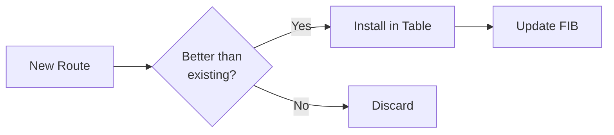
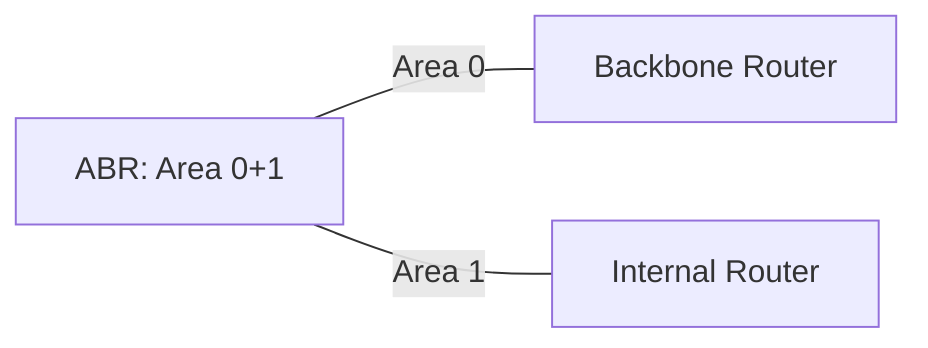
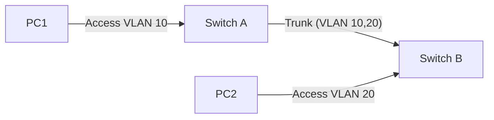
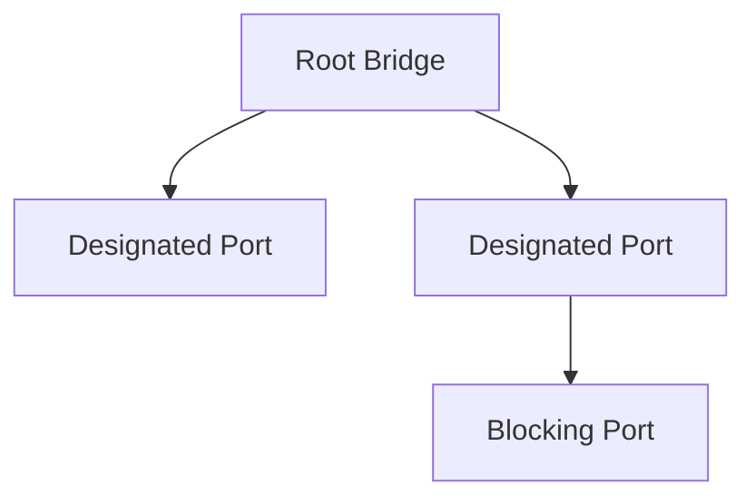
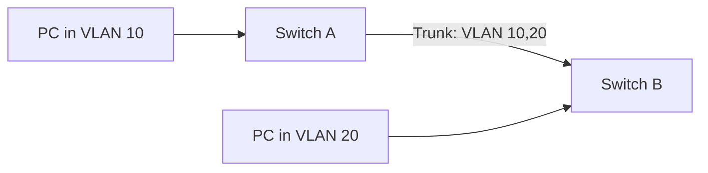
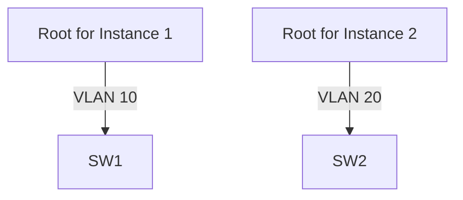
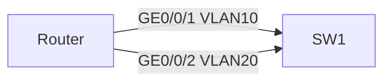
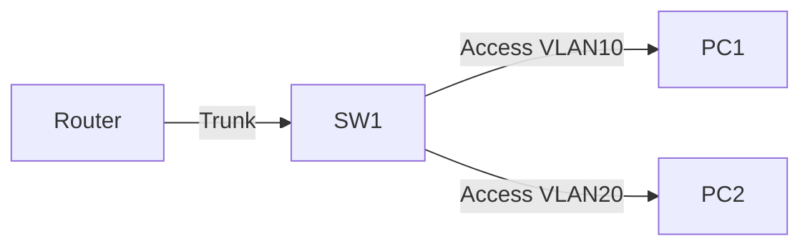
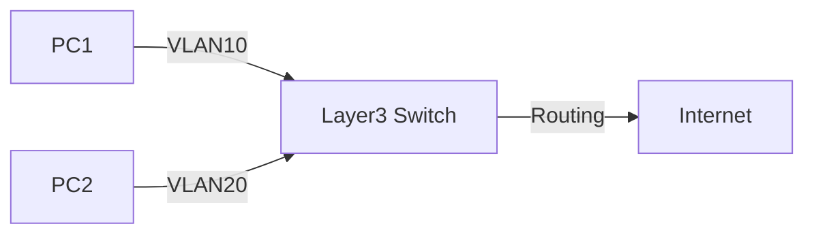
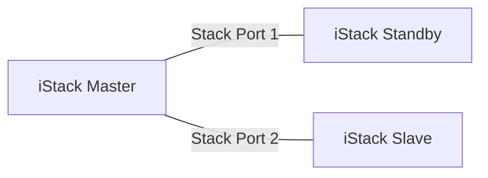

### **1. Communication & Networks**

#### **1.1 Network Communication Concepts**

-   **Definition**:
    
    -   Communication = Information exchange between people/things via a medium.
        
    -   Network communication = Communication between terminal devices via computer networks.
        
-   **Examples**:
    
    -   File transfer between two computers (direct cable).
        
    -   File download via the internet.
        
-   **Data Communication Network**:
    
    -   Composed of routers, switches, firewalls, APs, PCs, servers.
        
    -   **Function**: Implements data communication.
        

#### **1.2 Information Transfer Process**

-   **Encapsulation/Decapsulation**:
    
    -   **Data payload**  → Add  **header/tail**  →  **Packet**  → Forwarded via gateways/routers.
        
    -   **Encapsulation**: Adding headers/tails to data payload (e.g., adding destination address).
        
    -   **Decapsulation**: Removing headers/tails to extract data payload at the destination.
        
-   **Key Terms**:
    
 | Term            | Description                                        |
|------------------|----------------------------------------------------|
| Gateway          | Device for protocol conversion, routing, data exchange. |
| Router           | Forwards packets based on destination addresses.   |
| Terminal Device  | End device (e.g., PC, server, phone).              |
 

#### **1.3 Network Devices**

-   **Switches**:
    
    -   **Function**: Connects end-users (PCs/servers), performs Layer 2 switching.
        
    -   **Features**: Creates broadcast domains, enables basic security & redundancy.
        
-   **Routers**:
    
    -   **Function**: Forwards packets between networks, isolates broadcast domains.
        
    -   **Features**: Maintains routing tables, runs routing protocols, supports WAN access.
        
-   **Firewalls**:
    
    -   **Function**: Ensures secure communication between networks (e.g., intranet-internet).
        
    -   **Features**: Access control, user authentication, VPN support, NAT.
        
-   **Wireless Devices**:
    
    -   **AP Types**:
        
        -   **Fat AP**: Standalone (homes).
            
        -   **Fit AP**: Managed by AC (enterprises).
            
        -   **Cloud AP**: Managed via cloud platform (SMEs).
            
    -   **AC (Access Controller)**: Centralized management of Fit APs.
        

----------

### **2. Network Types & Topologies**

#### **2.1 Network Classification (by Coverage)**

-   **LAN (Local Area Network)**:
    
    -   Small area (e.g., office, home).
        
    -   Technologies: Ethernet, Wi-Fi.
        
-   **MAN (Metropolitan Area Network)**:
    
    -   City-wide (e.g., education MAN, municipal networks).
        
    -   Technologies: 10/100 Gbps Ethernet, WiMAX.
        
-   **WAN (Wide Area Network)**:
    
    -   Large geographical (e.g., cross-country).
        
    -   Technologies: HDLC, PPP.
        
    -   **Example**: Internet.
        

#### **2.2 Network Topologies**

-   **Types**:
    
  | Topology       | Pros                                 | Cons                                      |
|----------------|--------------------------------------|-------------------------------------------|
| Star           | Easy expansion, centralized control  | Central node failure = Total failure      |
| Bus            | Simple setup, cost-effective         | Bus failure = Total failure, low security |
| Ring           | Saves cables                         | Hard to add nodes                         |
| Mesh (Full)    | High reliability, efficiency         | High cost, scalability issues             |
| Mesh (Partial) | Lower cost than full mesh            | Lower reliability                         |

    
-   **Combined Topologies**: Used in practice for balance (cost/efficiency/reliability).
    

----------

### **3. Network Engineering & Engineers**

#### **3.1 Network Engineering**

-   **Definition**: Planning, designing, and implementing networks to meet user needs.
    
-   **Technical Modules**: Routing, switching, security, wireless, storage, cloud.
    
-   **Activities**: Network planning, design, implementation, troubleshooting.
    

#### **3.2 Network Engineer Roles**

-   **Responsibilities**:
    
    -   Design solutions, manage projects, troubleshoot, train stakeholders.
        
-   **Skills**:
    
    -   Technical (protocols, devices), soft skills (communication, problem-solving).
        
-   **Certification Path (Huawei)**:
    
    -   **HCIA-Datacom**: Basic theories (routing, switching, security).
        
    -   **HCIP-Datacom**: Advanced routing/switching, network design.
        
    -   **HCIE-Datacom**: Expert-level (SDN, automation).
        

----------

### **4. Key Protocols & Addressing**

#### **4.1 Special IP Addresses**

-   **Private IP Ranges**:
    
    -   Class A:  `10.0.0.0/8`
        
    -   Class B:  `172.16.0.0/12`
        
    -   Class C:  `192.168.0.0/16`
        
-   **Reserved Addresses**:
    
    -   `127.0.0.0/8`  (Loopback),  `169.254.0.0/16`  (Link-local).
        
    -   `0.0.0.0`  (Any network),  `255.255.255.255`  (Broadcast).
        

#### **4.2 Subnetting**

-   **Purpose**: Efficient IP utilization, smaller broadcast domains.
    
-   **Formula**:
    
    -   Host bits:  `n`  → Available IPs:  `2^n - 2`.
        
    -   **Example**:  `192.168.1.0/24`  → Subnetted to  `/26`  (4 subnets, 62 hosts each).
        

----------

### **5. Huawei Certification**

-   **HCIA-Datacom Focus Areas**:
    
    -   Routing/switching, WLAN, security, network automation.
        
-   **Exam Structure**:
    
    -   **HCIA**: 1 exam (basic concepts).
        
    -   **HCIP**: 1 core exam + 6 optional tracks (e.g., campus/WAN design).
        

----------

### **Quiz Recap (Module 01)**

1.  **Topology with highest reliability?**  
    →  **Full-mesh**  (direct interconnections).
    
2.  **IP Class Identification**:  
    →  `201.222.5.64`  =  **Class C**  (192–223).
    
3.  **Subnetting Example**:  
    → Department with 40 hosts needs  `/26`  subnet (e.g.,  `192.168.20.64/26`).


---

### **Module 02: Network Reference Model**

#### **1. Applications and Data**

- **Applications**: Meet user needs (e.g., web access, gaming, video streaming).

- **Data Generation**:

- Data = Carrier of information (binary 0s/1s).

- Applications generate data → Transmitted between devices.

- **Data Transmission**:

- Network engineers focus on **end-to-end transmission** (not application logic).

#### **2. OSI Reference Model (7 Layers)**

| Layer | Function | Key Protocols/Examples |

|----------------|--------------------------------------------------------------------------|------------------------------|

| **7. Application** | Provides user interfaces for apps. | HTTP, FTP, Telnet, DNS |

| **6. Presentation** | Translates data formats (encryption/compression). | JPEG, ASCII, SSL/TLS |

| **5. Session** | Manages sessions (establish/maintain/terminate). | NetBIOS, RPC |

| **4. Transport** | Ensures end-to-end data delivery (reliability/flow control). | TCP (connection-oriented), UDP (connectionless) |

| **3. Network** | Routes packets across networks (logical addressing). | IP, ICMP, IGMP |

| **2. Data Link** | Transfers frames between directly connected nodes (MAC addressing). | Ethernet, PPP, ARP |

| **1. Physical** | Transmits raw bits over physical media. | RJ45, Fiber, Wireless |

- **PDUs (Protocol Data Units)**:

- Application/Presentation/Session: **Data**

- Transport: **Segment** (TCP/UDP)

- Network: **Packet** (IP)

- Data Link: **Frame** (Ethernet)

- Physical: **Bits**

#### **3. TCP/IP Reference Model (4 Layers)**

| Layer | Equivalent OSI Layers | Key Protocols |

|--------------------|------------------------------|------------------------|

| **Application** | Application, Presentation, Session | HTTP, FTP, DNS, SMTP |

| **Transport** | Transport | TCP, UDP |

| **Internet** | Network | IP, ICMP, ARP |

| **Network Access** | Data Link, Physical | Ethernet, Wi-Fi |

#### **4. Key Protocols**

- **Application Layer**:

- **FTP (21)**: File transfer.

- **Telnet (23)**: Remote login.

- **HTTP (80)**: Web browsing.

- **DNS (53)**: Domain-to-IP resolution.

- **Transport Layer**:

- **TCP**: Reliable (3-way handshake, sequencing, flow control).

- **Header Fields**: Source/dest ports, sequence/ack numbers, window size.

- **UDP**: Unreliable but fast (low overhead).

- **Header Fields**: Source/dest ports, length, checksum.

- **Network Layer**:

- **IP**: Connectionless packet forwarding.

- **ICMP**: Error reporting (e.g., `ping`, `tracert`).

- **ARP**: Maps IP to MAC addresses.

- **Data Link Layer**:

- **Ethernet**: LAN switching (MAC addresses).

- **PPP/PPPoE**: WAN connections.

#### **5. Data Encapsulation/Decapsulation**

- **Sender**:

1. **Application → Transport**: Data + TCP/UDP header = **Segment**.

2. **Transport → Network**: Segment + IP header = **Packet**.

3. **Network → Data Link**: Packet + Ethernet header/trailer = **Frame**.

4. **Data Link → Physical**: Frame → **Bits**.

- **Receiver**:

- Reverse process (decapsulation).

#### **6. TCP vs. UDP**

| **Feature** | TCP | UDP |

|-------------------|------------------------------|------------------------------|

| **Reliability** | ✅ (Acknowledgments, retransmissions) | ❌ (Best-effort) |

| **Connection** | Connection-oriented (3-way handshake) | Connectionless |

| **Speed** | Slower (overhead) | Faster |

| **Use Cases** | Web, email, file transfer | Video streaming, DNS, VoIP |

#### **7. ICMP Functions**

- **Error Reporting**:

- `Destination Unreachable`, `Time Exceeded` (used in `tracert`).

- **Control Messages**:

- `Redirect` (optimizes routing paths).

- **Diagnostic Tools**:

- `ping`: Tests reachability (ICMP Echo Request/Reply).

- `tracert`: Maps path to destination (TTL manipulation).

#### **8. ARP Process**

1. **ARP Request** (Broadcast): "Who has IP X?"

2. **ARP Reply** (Unicast): "IP X is at MAC Y."

3. Devices cache ARP entries (timeout: 180s).

#### **9. Standardization Bodies**

- **IETF**: Internet standards (RFCs for TCP/IP).

- **IEEE**: Hardware standards (e.g., 802.3 Ethernet, 802.11 Wi-Fi).

- **ISO**: OSI model (ISO 7489).

---

### **Quiz Recap (Module 02)**

1. **Benefits of Layered Models**:

- Clear function boundaries, standardization, compatibility.

2. **Protocols by Layer**:

- Application: HTTP/FTP

- Transport: TCP/UDP

- Network: IP/ICMP

- Data Link: Ethernet/PPP

---

**Key Revision Tips**:

- Memorize OSI/TCP/IP layer functions and PDUs.

- Practice `ping`/`tracert` commands and ARP workflows.

- Contrast TCP (reliable) vs. UDP (unreliable) use cases.


### Module 03: Huawei VRP Basics

---

#### **1. VRP Overview**

- **Definition**:

- VRP (Versatile Routing Platform) is Huawei's universal network operating system for routers, switches, and other data communication devices.

- Provides a unified user interface and management framework.

- **Key Functions**:

- Device management (CLI, web system).

- Control plane functions (routing, security).

- Forwarding plane interface.

- **VRP Evolution**:

- VRP5: Component-based design (widely used).

- VRP8: Supports multi-process, multi-core, SDN (e.g., NE series routers).

---

#### **2. File System & Storage**

- **Storage Media**:

- **SDRAM**: Temporary runtime data (volatile).

- **Flash**: Stores OS, configuration files (non-volatile).

- **NVRAM**: Log buffers (written to flash periodically).

- **SD Card/USB**: External storage for backups/upgrades.

- **Key File Types**:

- **System Software** (`.cc`): Required for device startup.

- **Configuration File** (`.cfg`, `.zip`, `.dat`): Stores device settings.

- **Patch File** (`.pat`): Fixes bugs in system software.

- **PAF File** (`.bin`): Feature license file.

- **File System Commands**:

| **Command** | **Function** |

|-----------------------|---------------------------------------|

| `dir` | Lists files in a directory. |

| `pwd` | Shows current working directory. |

| `cd <directory>` | Changes directory. |

| `mkdir <directory>` | Creates a directory. |

| `copy <src> <dest>` | Copies a file. |

| `move <src> <dest>` | Moves a file. |

| `rename <old> <new>` | Renames a file. |

| `delete <file>` | Moves file to recycle bin. |

| `undelete <file>` | Restores a deleted file. |

| `reset recycle-bin` | Permanently deletes recycled files. |

---

#### **3. Device Management**

- **Login Methods**:

- **CLI (Command Line Interface)**:

- **Console**: Local connection (using serial cable).

- **Telnet/SSH**: Remote login (Telnet unencrypted, SSH encrypted).

- **Web System**: GUI-based management (HTTPS).

- **User Interfaces**:

- **Console (CON)**: Physical port for local access.

- **VTY (Virtual Terminal)**: Virtual interface for remote access (supports multiple sessions).

- **User Levels & Privileges**:

| **Level** | **Name** | **Commands Allowed** |

|----------|----------------|------------------------------------------|

| 0 | Visit | `ping`, `tracert` (diagnostics only). |

| 1 | Monitor | `display` commands (read-only). |

| 2 | Configuration | Service config (e.g., routing, IP). |

| 3-15 | Management | System-level commands (e.g., file ops). |

---

#### **4. CLI Basics**

- **Command Structure**:

- **Command Word** (e.g., `display`) + **Keywords** + **Parameters**.

- Example: `display ip interface GigabitEthernet 0/0/1`.

- **Command Views**:

| **View** | **Prompt** | **Access Command** |

|-------------------|--------------------------|--------------------------------|

| User View | `<Huawei>` | Default after login. |

| System View | `[Huawei]` | `system-view` from user view. |

| Interface View | `[Huawei-GE0/0/1]` | `interface GE0/0/1`. |

| Protocol View | `[Huawei-ospf-1]` | `ospf 1`. |

- **CLI Shortcuts**:

- `Tab`: Auto-completes commands.

- `?`: Displays help (partial/full).

- `Ctrl+Z`: Returns to user view.

- `Ctrl+A`: Moves cursor to line start.

- `Ctrl+C`: Stops current command.

- **Common Mistakes**:

- `Error: Incomplete command`: Missing parameter.

- `Error: Ambiguous command`: Partial keyword matches multiple commands.

---

#### **5. Basic Configuration Commands**

- **Device Setup**:

- `sysname <name>`: Sets device hostname.

- `clock timezone <zone> add/minus <offset>`: Configures time zone.

- `clock datetime <HH:MM:SS YYYY-MM-DD>`: Sets date/time.

- **User Authentication**:

```bash

[Huawei] user-interface vty 0 4 # Enters VTY view for sessions 0-4.

[Huawei-ui-vty0-4] authentication-mode password # Sets password auth.

[Huawei-ui-vty0-4] set authentication password cipher <password>

[Huawei-ui-vty0-4] user privilege level <0-15> # Sets privilege level.

```

- **IP Address Configuration**:

```bash

[Huawei] interface GigabitEthernet 0/0/1

[Huawei-GE0/0/1] ip address 192.168.1.1 24

```

- **Configuration Management**:

- `display current-configuration`: Shows active settings.

- `save <file.cfg>`: Saves current config to a file.

- `reset saved-configuration`: Clears saved config.

- `startup saved-configuration <file.cfg>`: Sets config for next startup.

- `reboot`: Restarts the device.

---

#### **6. Case Study: Basic Setup**

**Scenario**:

- Configure device name, IP address, and remote login for a router.

**Steps**:

1. Set device name:

```bash

<Huawei> system-view

[Huawei] sysname R1

```

2. Configure IP address:

```bash

[R1] interface GigabitEthernet 0/0/1

[R1-GE0/0/1] ip address 192.168.1.1 24

```

3. Enable remote login:

```bash

[R1] user-interface vty 0 4

[R1-ui-vty0-4] authentication-mode password

[R1-ui-vty0-4] set authentication password cipher huawei123

[R1-ui-vty0-4] user privilege level 2

```

4. Save configuration:

```bash

<R1> save

<R1> startup saved-configuration vrpcfg.zip

```

---

### **Quiz Recap (Module 03)**

1. **VRP Version**:

- Most devices use **VRP5** (some high-end use VRP8).

2. **Console Login**:

- Only **1 user** can log in via console at a time.

3. **Setting Startup Config**:

- `startup saved-configuration <filename.cfg>`.

---

**Key Revision Tips**:

- Practice CLI commands in Huawei eNSP simulator.

- Memorize file operations (`copy`, `delete`, `save`).

- Understand user privilege levels (0-15).


### **Module 04: Network Layer Protocols and IP Addressing**

---

#### **1. Network Layer Protocols**
- **Core Protocol**: IPv4 (Internet Protocol v4)  
  - **Function**: Logical addressing, routing, fragmentation.  
  - **Packet Format**:  
    | **Field**         | **Size** | **Function**                                  |  
    |-------------------|----------|-----------------------------------------------|  
    | Version           | 4 bits   | IPv4 (`4`) or IPv6 (`6`).                     |  
    | TTL               | 8 bits   | Prevents loops (decremented per router hop).  |  
    | Protocol          | 8 bits   | Identifies next-layer protocol (e.g., `1=ICMP`, `6=TCP`). |  
    | Source/Dest IP    | 32 bits  | Logical addresses.                            |  
  - **Fragmentation**: Splits packets > MTU (uses **Flags** + **Fragment Offset**).  

- **Key Protocols**:  
  - **ICMP**: Diagnostics (e.g., `ping`, `tracert`).  
  - **IGMP**: Multicast group management.  
  - **ARP**: Maps IP → MAC (same subnet).  

---

#### **2. IPv4 Addressing**
- **Address Structure**:  
  - **Network Part**: Identifies subnet (e.g., `192.168.1.0/24`).  
  - **Host Part**: Identifies device (e.g., `.1` in `192.168.1.1`).  
  - **Subnet Mask**: Distinguishes network/host bits (e.g., `/24` = `255.255.255.0`).  

- **Address Classes**:  
  | **Class** | **Range**              | **Default Mask** | **Use**                  |  
  |-----------|------------------------|------------------|--------------------------|  
  | A         | `1.0.0.0`–`126.255.255.255` | `/8`            | Large networks.          |  
  | B         | `128.0.0.0`–`191.255.255.255` | `/16`           | Medium networks.         |  
  | C         | `192.0.0.0`–`223.255.255.255` | `/24`           | Small networks.          |  
  | D         | `224.0.0.0`–`239.255.255.255` | N/A             | Multicast.               |  
  | E         | `240.0.0.0`–`255.255.255.255` | N/A             | Experimental.            |  

- **Special Addresses**:  
  | **Address**         | **Purpose**                                |  
  |---------------------|--------------------------------------------|  
  | `0.0.0.0`           | "This network" (DHCP requests).            |  
  | `127.0.0.0/8`       | Loopback (e.g., `127.0.0.1`).              |  
  | `255.255.255.255`   | Limited broadcast (local subnet).          |  
  | `169.254.0.0/16`    | Link-local (APIPA).                        |  

- **Public vs. Private IPs**:  
  - **Private Ranges**:  
    - `10.0.0.0/8`, `172.16.0.0/12`, `192.168.0.0/16`.  
  - **NAT**: Translates private IPs to public for internet access.  

---

#### **3. Subnetting**
- **Purpose**: Optimize IP usage, reduce broadcast domains.  
- **Formula**:  
  - **Hosts per Subnet**: `2^H - 2` (H = host bits).  
  - **Subnets**: `2^S` (S = borrowed bits).  
- **Example**: `192.168.1.0/24` → Split into `/26` subnets:  
  ```markdown
  - Subnet 1: 192.168.1.0/26 (Hosts: 1–62).  
  - Subnet 2: 192.168.1.64/26 (Hosts: 65–126).  
  - Subnet 3: 192.168.1.128/26 (Hosts: 129–190).  
  - Subnet 4: 192.168.1.192/26 (Hosts: 193–254).  
  ```

---

#### **4. ICMP (Internet Control Message Protocol)**
- **Functions**:  
  - **Error Reporting**: e.g., `Destination Unreachable`.  
  - **Query/Reply**: e.g., `Echo Request/Reply` (`ping`).  
- **Key Applications**:  
  | **Tool**   | **Function**                                  | **ICMP Type**      |  
  |------------|----------------------------------------------|--------------------|  
  | `ping`     | Tests reachability.                          | Echo (8), Reply (0)|  
  | `tracert`  | Maps path (uses TTL expiry).                 | Time Exceeded (11) |  
  - **ICMP Redirect**: Routers optimize paths (e.g., "Use better gateway").  

---

#### **5. IP Address Configuration & Planning**
- **Configuration (Huawei CLI)**:  
  ```bash
  [Huawei] interface GigabitEthernet 0/0/1
  [Huawei-GE0/0/1] ip address 10.1.1.1 255.255.255.0  # Or ip address 10.1.1.1 24
  ```
- **IP Planning Principles**:  
  - **Uniqueness**: No duplicate IPs.  
  - **Continuity**: Group addresses for summarization (e.g., `10.1.0.0/16`).  
  - **Scalability**: Reserve space for growth.  
- **Example Plan**:  
  | **Department** | **Subnet**       | **IP Range**          |  
  |----------------|------------------|-----------------------|  
  | R&D            | `192.168.1.0/24` | `192.168.1.1–254`     |  
  | Marketing      | `192.168.2.0/24` | `192.168.2.1–254`     |  

---

### **Key Formulas & Tables**
- **Subnet Cheat Sheet**:  
  | **Mask Length** | **Subnet Mask**    | **Hosts** |  
  |-----------------|--------------------|-----------|  
  | `/24`           | `255.255.255.0`    | 254       |  
  | `/25`           | `255.255.255.128`  | 126       |  
  | `/26`           | `255.255.255.192`  | 62        |  
  | `/30`           | `255.255.255.252`  | 2         |  

- **Network Address Calculation**:  
  - `IP AND Subnet Mask = Network Address` (e.g., `192.168.1.42 AND 255.255.255.0 = 192.168.1.0`).  

---

### **Quiz Recap**
1. **IP Class Identification**:  
   - `201.222.5.64` → **Class C** (192–223).  
2. **Subnet Allocation**:  
   - 40 hosts → Use `/26` (62 hosts), e.g., `192.168.20.64/26`.  
3. **TTL Function**:  
   - Prevents routing loops (decremented per hop; packet discarded at `0`).


### **Module 05: IP Routing Basics**

---

#### **1. Routing Fundamentals**
**Key Concepts**:
- **Route**: Path to a destination network (stored in routing table).  
- **Routing Table Entry**:  
  ```markdown
  Destination/Mask | Protocol | Pre | Cost | Next Hop | Interface
  ```
- **Route Types**:  
  | **Type**      | **Source**                          | **Preference** |  
  |---------------|-------------------------------------|----------------|  
  | Direct        | Automatically generated (connected) | 0              |  
  | Static        | Manually configured                 | 60             |  
  | Dynamic (OSPF)| Routing protocols                   | 10 (OSPF)      |  

**Route Selection Process**:  
1. **Longest Prefix Match**:  
   - `192.168.1.0/24` > `192.168.0.0/16` (for destination `192.168.1.5`)  
2. **Compare Preferences**: Lower value = higher priority  
   - Direct (0) > OSPF (10) > Static (60)  
3. **Compare Metrics**: Lower cost = better path (if same preference)  

---

#### **2. Static Routing**
**Configuration (Huawei CLI)**:
```bash
[Huawei] ip route-static <network> <mask> <next_hop> 
# Example: 
[Huawei] ip route-static 10.2.0.0 255.255.0.0 192.168.1.2
```
**Use Cases**:  
- Small networks with fixed paths  
- Backup routes (floating static) via `preference` adjustment  
**Pros & Cons**:  
| **Advantages**       | **Disadvantages**         |  
|----------------------|---------------------------|  
| No protocol overhead | Manual maintenance        |  
| Security             | No failover (unless backup)|  

---

#### **3. Dynamic Routing Protocols**
**Protocol Types**:
| **Type**       | **Protocols**         | **Use Case**                |  
|----------------|-----------------------|-----------------------------|  
| **IGP**        | OSPF, IS-IS, RIP      | Internal networks (AS)      |  
| **EGP**        | BGP                   | Between autonomous systems  |  
| **Distance-Vector** | RIP, EIGRP      | Small networks              |  
| **Link-State** | OSPF, IS-IS           | Large networks              |  

**OSPF Basics**:  
- **Area Hierarchy**: Backbone (Area 0) + non-backbone areas  
- **Cost Calculation**: `Cost = Reference BW (100Mbps) / Interface BW`  
- **Key Commands**:  
  ```bash
  [Huawei] ospf 1
  [Huawei-ospf-1] area 0
  [Huawei-ospf-1-area-0.0.0.0] network 192.168.1.0 0.0.0.255
  ```

---

#### **4. Routing Table Analysis**
**`display ip routing-table` Output**:
```markdown
Destination/Mask   Proto   Pre Cost Flags NextHop       Interface  
10.1.1.0/24        Direct  0   0    D     10.1.1.1      GE0/0/1  
20.2.2.0/24        Static  60  0    RD    192.168.1.2   GE0/0/0  
```
**Flag Meanings**:  
- `D`: Download to Forwarding Information Base (FIB)  
- `R`: Relay route (recursive lookup)  

**Route Installation Logic**:  


---

#### **5. Advanced Features**
**Route Recursion**:  
- Resolves indirect next hops (e.g., static route via another route)  
**FIB (Forwarding Table)**:  
- Hardware-optimized version of routing table  
- Updated when routing table changes  
**Load Balancing**:  
- Equal-cost multipath (ECMP) for traffic distribution  
  ```bash
  # Huawei ECMP default: 4 paths
  [Huawei] ip load-balance ecmp 8  # Increase to 8 paths
  ```

---

#### **6. Troubleshooting Commands**
| **Command**                     | **Purpose**                                  |  
|---------------------------------|---------------------------------------------|  
| `display ip routing-table`      | Show all routes                             |  
| `tracert <ip>`                  | Trace path to destination                   |  
| `display ospf peer`             | Verify OSPF neighbor adjacency              |  
| `reset ip routing-table statistics` | Clear routing table counters            |  

---

### **Key Concepts Summary**
- **Direct Routes**: Automatically added for connected interfaces (preference 0).  
- **Static vs. Dynamic**:  
  - Static: Manual, no overhead.  
  - Dynamic: Adapts to topology changes (e.g., OSPF).  
- **Route Selection Order**:  
  1. Prefix length  
  2. Preference  
  3. Metric  

---

### **Configuration Example**
**Static Route for Backup**:  
```bash
# Primary route
[Huawei] ip route-static 10.0.0.0 255.0.0.0 192.168.1.1
# Backup route (higher preference)
[Huawei] ip route-static 10.0.0.0 255.0.0.0 172.16.1.1 preference 80
```

---

### **Quiz Recap**  
1. **Best route to `10.1.1.5`?**  
   - `10.1.1.0/24` (longer mask) > `10.0.0.0/8`  
2. **Static route preference?**  
   - Default = **60**  
3. **OSPF cost for 1Gbps link?**  
   - `Cost = 100 / 1000 = 0.1` → **1** (rounded up)


### **Module 06: OSPF Basics**

---

#### **1. OSPF Overview**
- **Type**: Link-state IGP (Interior Gateway Protocol)  
- **Standard**: RFC 2328 (OSPFv2 for IPv4)  
- **Key Features**:  
  - Fast convergence using SPF algorithm  
  - Hierarchical design (areas)  
  - VLSM/CIDR support  
  - Authentication (plain text/MD5)  
  - Loop-free topology  
- **Administrative Distance**: 110  

---

#### **2. OSPF Operation Fundamentals**
| **Component**       | **Function**                                                                 | **Key Details**                                                                 |
|---------------------|-----------------------------------------------------------------------------|--------------------------------------------------------------------------------|
| **Router ID**       | Unique identifier for OSPF router                                           | Format: IPv4 address (e.g., `1.1.1.1`)<br>Derived from highest loopback IP or manual config |
| **Hello Protocol**  | Discovers/maintains neighbors                                               | Multicast: `224.0.0.5`<br>Default timers: 10s (Ethernet), 30s (NBMA)         |
| **Neighbor States** | Stages of OSPF adjacency                                                    | `Down` → `Init` → `2-Way` → `ExStart` → `Exchange` → `Loading` → `Full`       |
| **LSDB**            | Link-State Database (stores network topology)                               | All routers in an area have identical LSDB                                     |
| **SPF Calculation** | Dijkstra algorithm computes shortest path                                  | Runs when LSDB changes                                                        |

---

#### **3. OSPF Network Types**
| **Type**             | **DR/BDR Election** | **Hello Timer** | **Use Case**         |  
|----------------------|---------------------|-----------------|----------------------|  
| **Broadcast**        | Yes                 | 10s             | Ethernet LANs        |  
| **Point-to-Point**   | No                  | 10s             | Serial links (PPP)   |  
| **NBMA**             | Yes                 | 30s             | Frame Relay          |  
| **Point-to-Multipoint** | No              | 30s             | Hub-and-spoke VPNs   |  

- **DR/BDR Roles**:  
  - **DR** (Designated Router): Generates network LSAs for the segment.  
  - **BDR** (Backup DR): Takes over if DR fails.  
  - **Election Criteria**: Highest OSPF priority → highest Router ID.  

---

#### **4. OSPF Areas**
- **Hierarchy**:  
  - **Area 0 (Backbone)**: Mandatory; all other areas connect to it.  
  - **Non-Backbone Areas**: e.g., Area 1, Area 2.  
- **Router Types**:  
  | **Type** | **Function**                                  | **Location**               |  
  |----------|----------------------------------------------|----------------------------|  
  | IR       | Internal Router (all interfaces in 1 area)   | Non-backbone areas         |  
  | ABR      | Area Border Router (connects ≥2 areas)       | Area 0 + other areas       |  
  | ASBR     | AS Boundary Router (redistributes externals) | Any area                   |  
- **LSA Types**:  
  | **Type** | **Name**            | **Generated By** | **Scope**       |  
  |----------|---------------------|------------------|-----------------|  
  | 1        | Router LSA          | All routers      | Area-local      |  
  | 2        | Network LSA         | DR               | Area-local      |  
  | 3        | Summary LSA         | ABR              | Inter-area      |  
  | 5        | External LSA        | ASBR             | OSPF domain     |  

---

#### **5. Basic OSPF Configuration (Huawei)**
```bash
# Enable OSPF process 10 with Router ID
[Huawei] ospf 10 router-id 1.1.1.1

# Configure Area 0
[Huawei-ospf-10] area 0
[Huawei-ospf-10-area-0.0.0.0] network 192.168.1.0 0.0.0.255  # Advertise network

# Configure Area 1
[Huawei-ospf-10] area 1
[Huawei-ospf-10-area-0.0.0.1] network 10.1.1.0 0.0.0.255

# Set OSPF priority (DR election)
[Huawei-GigabitEthernet0/0/1] ospf dr-priority 100
```

---

#### **6. OSPF Verification Commands**
| **Command**                     | **Purpose**                                  |  
|---------------------------------|---------------------------------------------|  
| `display ospf peer`             | Shows neighbor adjacency states             |  
| `display ospf lsdb`             | Lists LSAs in the database                  |  
| `display ospf routing`          | Displays OSPF-learned routes                |  
| `display ospf interface`        | Shows OSPF interface parameters             |  
| `display ospf error`            | Displays OSPF error statistics              |  

**Sample Output**:  
```markdown
OSPF Process 10 with Router ID 1.1.1.1  
Neighbors:  
  Area 0.0.0.0 interface 192.168.1.1 (GE0/0/1)  
  Address: 192.168.1.2  State: Full  Mode: Nbr is DR  Priority: 1  
```

---

#### **7. Advanced Features**
- **Authentication**:  
  ```bash
  # Enable MD5 authentication
  [Huawei-ospf-10-area-0.0.0.0] authentication-mode md5 1 cipher MyPassword
  ```
- **Route Summarization (at ABR)**:  
  ```bash
  [Huawei-ospf-10-area-0.0.0.1] abr-summary 172.16.0.0 255.255.0.0
  ```
- **Cost Adjustment**:  
  ```bash
  [Huawei-GigabitEthernet0/0/1] ospf cost 50  # Default=1 for 100Mbps link
  ```

---

#### **8. Troubleshooting OSPF**
**Common Issues & Fixes**:  
| **Issue**                 | **Symptom**                        | **Solution**                     |  
|---------------------------|------------------------------------|----------------------------------|  
| **Mismatched Area ID**    | Neighbors stuck in `Init/ExStart`  | Verify `area` config on both ends |  
| **MTU Mismatch**          | Adjacency flapping                 | Set identical MTU on interfaces  |  
| **Authentication Fail**   | No Hello packets received          | Match auth type/keys             |  
| **Network Misadvertised** | Missing routes                     | Check `network` statements       |  

---

#### **9. OSPFv3 for IPv6**
- **Key Differences from OSPFv2**:  
  - Uses link-local addresses (`FE80::/10`) for neighbor discovery.  
  - Runs per-link (not per-subnet).  
  - New LSA types (e.g., Link-LSA, Intra-Area-Prefix-LSA).  
- **Configuration**:  
  ```bash
  [Huawei] ospfv3 1
  [Huawei-ospfv3-1] router-id 1.1.1.1
  [Huawei-ospfv3-1] area 0
  [Huawei-ospfv3-1-area-0.0.0.0] quit
  [Huawei-GigabitEthernet0/0/1] ospfv3 1 area 0
  ```

---

### **Key Concepts Summary**
- **Neighbor vs. Adjacency**:  
  - **Neighbor**: Routers exchanging Hellos (2-Way state).  
  - **Adjacency**: Routers synchronizing LSDBs (Full state).  
- **DR/BDR Election**: Non-preemptive; occurs when:  
  1. Interface becomes active in broadcast/NBMA network.  
  2. Priority > 0.  
- **SPF Triggers**:  
  - New LSA received.  
  - LSA aged out.  
  - Interface cost changed.  

---

### **Configuration Example**
**Multi-Area OSPF**:  


**R1 Configuration**:  
```bash
ospf 10 router-id 1.1.1.1
 area 0
  network 10.0.12.0 0.0.0.255
 area 1
  network 10.0.13.0 0.0.0.255
```

---

### **Quiz Recap**  
1. **OSPF Administrative Distance?**  
   → **110**  
2. **Default Hello Timer on Ethernet?**  
   → **10 seconds**  
3. **LSA Type for External Routes?**  
   → **Type 5** (AS External LSA)


### **Module 07: Ethernet Switching Basics**

---

#### **1. Ethernet Fundamentals**
| **Component**       | **Description**                                                                 | **Key Details**                                                                 |
|---------------------|-------------------------------------------------------------------------------|--------------------------------------------------------------------------------|
| **MAC Address**     | Unique 48-bit hardware identifier (e.g., `48-A4-72-1C-8F-4F`)                | - Burned into NIC<br>- First 24 bits = OUI (Manufacturer ID)                  |
| **Ethernet Frame**  | Data link layer encapsulation format                                          |  |
| **Frame Fields**    |                                                                               | - **Preamble**: Sync (7 bytes)<br>- **SFD**: Start delimiter (1 byte)<br>- **Src/Dest MAC** (6+6 bytes)<br>- **Type/Length** (2 bytes)<br>- **Data** (46-1500 bytes)<br>- **FCS**: Error check (4 bytes) |

---

#### **2. Switch Operations**
**Key Functions**:
| **Function**    | **Description**                                                                 |
|-----------------|-------------------------------------------------------------------------------|
| **Learning**    | Builds MAC table by inspecting source MAC of incoming frames                 |
| **Forwarding**  | Sends frames to specific port based on destination MAC                       |
| **Flooding**    | Broadcasts frames for unknown MACs or broadcast traffic (`FFFF.FFFF.FFFF`)   |
| **Filtering**   | Drops frames if source/destination MAC are on same port                      |

**MAC Address Table**:
```markdown
[Huawei] display mac-address
MAC Address    VLAN/VSI   Port                     Aging Time  
48A4-721C-8F4F 1          GE0/0/1                 300s  
0011-2233-4455 1          GE0/0/2                 N/A (Static)
```

---

#### **3. VLANs (Virtual LANs)**
**Concepts**:
- **Purpose**: Segment broadcast domains logically (not physically)
- **VLAN Range**: 1-4094 (VLAN 1 = default)
- **Port Types**:
  | **Type**       | **Behavior**                                  | **Use Case**              |
  |----------------|---------------------------------------------|--------------------------|
  | **Access**     | Carries single VLAN traffic (untagged)      | Host-to-switch           |
  | **Trunk**      | Carries multiple VLANs (tagged with 802.1Q) | Switch-to-switch         |
  | **Hybrid**     | Supports both tagged/untagged traffic       | Flexible deployments     |

**Configuration (Huawei)**:
```bash
# Create VLAN 10
[Huawei] vlan 10

# Configure access port (PC connection)
[Huawei-GigabitEthernet0/0/1] port link-type access
[Huawei-GE0/0/1] port default vlan 10

# Configure trunk port (switch uplink)
[Huawei-GigabitEthernet0/0/24] port link-type trunk
[Huawei-GE0/0/24] port trunk allow-pass vlan 10 20
```

---

#### **4. STP (Spanning Tree Protocol)**
**Purpose**: Prevents switching loops in redundant topologies  
**Protocols**:
- **STP** (802.1D): Original (50s convergence)
- **RSTP** (802.1w): Rapid STP (sub-second convergence)
- **MSTP** (802.1s): Multiple VLANs per instance  

**Key Roles**:
| **Role**          | **Function**                                                                 |
|-------------------|-----------------------------------------------------------------------------|
| **Root Bridge**   | Reference point for path calculations (lowest Bridge ID)                   |
| **Designated Port** | Non-root port forwarding traffic on segment                               |
| **Blocking Port** | Discards traffic to prevent loops                                          |

**Bridge ID = Priority (4-bit) + MAC Address**  
*Priority default: 32768 (configurable in multiples of 4096)*

---

#### **5. Link Aggregation (Eth-Trunk)**
**Concepts**:
- Bundles multiple physical links → single logical link
- **Benefits**: 
  - Increased bandwidth (up to 8:1)
  - Redundancy (failover in milliseconds)
- **Modes**:
  | **Mode**       | **Negotiation**       | **Requires LACP?** |  
  |----------------|----------------------|--------------------|  
  | **Manual**     | None                 | No                 |  
  | **LACP**       | Dynamic (802.3ad)    | Yes                |  

**Configuration**:
```bash
# Create Eth-Trunk
[Huawei] interface Eth-Trunk 1
[Huawei-Eth-Trunk1] mode lacp  # Or 'manual load-balance'

# Add physical ports
[Huawei] interface GigabitEthernet 0/0/1
[Huawei-GE0/0/1] eth-trunk 1
```

---

#### **6. Key Verification Commands**
| **Command**                     | **Function**                                  |
|---------------------------------|---------------------------------------------|
| `display vlan`                  | Shows VLAN-port mappings                    |
| `display stp brief`             | Lists STP port states                       |
| `display eth-trunk [id]`        | Displays Eth-Trunk status/members           |
| `display mac-address vlan 10`   | Filters MAC table by VLAN                   |
| `reset mac-address`             | Clears dynamic MAC entries                  |

---

### **Configuration Examples**
**VLAN Inter-Switch Connectivity**:


**STP Topology**:


---

### **Troubleshooting Guide**
| **Issue**                  | **Checkpoints**                              |
|----------------------------|---------------------------------------------|
| **No VLAN Connectivity**   | 1. Port VLAN memberships<br>2. Trunk allowed VLANs |
| **Switching Loop**         | 1. STP status<br>2. Redundant links without STP |
| **Eth-Trunk Down**         | 1. Physical link status<br>2. LACP consistency |
| **MAC Flapping**           | 1. Duplicate IPs<br>2. Physical loops       |

---

### **Key Formulas & Values**
- **STP Timers**:
  - Hello: 2s (RSTP), 10s (STP)
  - Max Age: 20s (RSTP), 20-40s (STP)
- **Bandwidth Calculation**:
  - Eth-Trunk = Σ(Member link speeds)  
    *e.g., 4x1Gbps links = 4Gbps logical link*
- **VLAN Tag Size**: 4 bytes (802.1Q header)


### **Module 08: VLAN Principles and Configuration**

---

#### **1. VLAN Fundamentals**
**Core Concepts**:
- **Purpose**: Logically partition physical switch into multiple broadcast domains
- **Benefits**:
  - Reduced broadcast traffic
  - Enhanced security (isolate sensitive departments)
  - Simplified network management
- **VLAN Range**:
  - Standard: 1-4094
  - Default: VLAN 1 (management VLAN)
  - Reserved: 1006-4094 (extended range)

**Frame Tagging (802.1Q)**:
```markdown
| DA (6) | SA (6) | 0x8100 (2) | PRI (3) | CFI (1) | VID (12) | Type (2) | Data (46-1500) | FCS (4) |
```
- **VID**: VLAN ID (12 bits = 4094 VLANs)
- **PRI**: 802.1p priority (QoS)
- **CFI**: Canonical Format Indicator (always 0 for Ethernet)

---

#### **2. VLAN Port Types**
| **Type**   | **Incoming Frame Handling**       | **Outgoing Frame Handling**      | **Use Case**               |
|------------|-----------------------------------|----------------------------------|----------------------------|
| **Access** | Tags with PVID if untagged        | Removes tag if VID = PVID        | Host-to-switch             |
| **Trunk**  | Accepts tagged frames only*       | Tags with VID if ≠ Native VLAN   | Switch-to-switch           |
| **Hybrid** | Accepts both tagged/untagged      | Tags/untags per port config      | Multi-device connections   |

*\*Trunk ports accept untagged frames only for native VLAN*

---

#### **3. VLAN Configuration (Huawei CLI)**
**Basic Setup**:
```bash
# Create VLAN 10
[SW1] vlan 10
[SW1-vlan10] description HR_Department

# Configure access port (PC connection)
[SW1] interface GigabitEthernet 0/0/1
[SW1-GE0/0/1] port link-type access
[SW1-GE0/0/1] port default vlan 10

# Configure trunk port (to other switch)
[SW1] interface GigabitEthernet 0/0/24
[SW1-GE0/0/24] port link-type trunk
[SW1-GE0/0/24] port trunk allow-pass vlan 10 20  # Permit specific VLANs
[SW1-GE0/0/24] port trunk pvid vlan 1            # Set native VLAN
```

**Hybrid Port (VoIP Example)**:
```bash
# Phone (tagged VLAN 10) + PC (untagged VLAN 20)
[SW1-GE0/0/15] port link-type hybrid
[SW1-GE0/0/15] port hybrid pvid vlan 20          # Untagged traffic → VLAN 20
[SW1-GE0/0/15] port hybrid tagged vlan 10        # Preserve VoIP tags
[SW1-GE0/0/15] port hybrid untagged vlan 20      # Remove tags for PC
```

---

#### **4. VLAN Verification Commands**
| **Command**                     | **Function**                                  |
|---------------------------------|---------------------------------------------|
| `display vlan`                  | Shows all VLANs and member ports            |
| `display port vlan`             | Displays VLAN settings per interface        |
| `display vlan 10`               | Details for specific VLAN                  |
| `display interface brief`       | Lists interface link/VLAN status            |
| `display mac-address vlan 10`   | Shows MAC table entries in VLAN 10         |

**Sample Output**:
```markdown
VLAN ID: 10  
VLAN Type: static  
Route Interface: not configured  
Description: HR_Department  
Tagged Ports: GE0/0/24  
Untagged Ports: GE0/0/1  
```

---

#### **5. VLAN Design Best Practices**
1. **Native VLAN Security**:
   - Change from default VLAN 1 (e.g., `port trunk pvid vlan 999`)
   - Prevent VLAN hopping: `[SW1-GE0/0/24] port trunk only allow-pass vlan 10,20`
2. **Voice VLAN Configuration**:
   ```bash
   [SW1] vlan 100
   [SW1-vlan100] description Voice_VLAN
   [SW1-GE0/0/1] voice-vlan 100 enable  # Auto-detect VoIP traffic
   ```
3. **Private VLANs**:
   - Isolate ports within same VLAN (e.g., hotel guest networks)
   ```bash
   [SW1] vlan 200
   [SW1-vlan200] private-vlan isolated  # Ports can't communicate
   ```

---

#### **6. Troubleshooting Guide**
| **Issue**                  | **Checkpoints**                              | **Solutions**                  |
|----------------------------|---------------------------------------------|--------------------------------|
| **Inter-VLAN Fail**        | 1. Trunk allowed VLANs<br>2. Router-on-a-Stick config | `port trunk allow-pass vlan add XX` |
| **Intra-VLAN Fail**        | 1. Access port PVID<br>2. STP blocking      | `display stp brief`            |
| **VLAN Not Propagating**   | 1. VTP domain/config (if used)<br>2. Trunk status | `display vtp status`         |
| **Native VLAN Mismatch**   | CDP/LLDP warnings                           | Match native VLAN on trunk ends |

---

#### **7. Advanced Features**
**VLAN Stacking (QinQ)**:
- Encapsulates customer VLANs in service provider VLAN
- Configuration:
  ```bash
  [SW1-GE0/0/24] port link-type dot1q-tunnel
  [SW1-GE0/0/24] port default vlan 1000  # Add outer tag VLAN 1000
  ```

**VLAN Mapping**:
- Rewrites VLAN tags (1:1 or 2:1 mapping)
  ```bash
  [SW1-GE0/0/24] port vlan-mapping vlan 10 map-vlan 100  # 10→100
  ```

---

### **Configuration Examples**
**Multi-Switch VLAN Topology**:


**Router-on-a-Stick**:
```bash
# Router Configuration (Huawei)
[Router] interface GigabitEthernet 0/0/1.10
[Router-GE0/0/1.10] dot1q termination vid 10
[Router-GE0/0/1.10] ip address 192.168.10.1 24
```

---

### **Key Concepts Summary**
- **PVID (Port VLAN ID)**: Default VLAN for untagged ingress frames
- **VLAN Types**:
  - **Static**: Ports manually assigned
  - **Dynamic**: Assigned via MAC/IP (rare)
- **Protocol VLANs**: Group traffic by protocol (e.g., IPX, IPv6)
- **MAC VLAN**: Assign VLAN based on source MAC


### **Module 09: STP Principles and Configuration**

---

#### **1. STP Fundamentals**
**Purpose**: Prevent switching loops in redundant topologies  
**Loop Dangers**:  
- Broadcast storms  
- MAC table instability  
- Duplicate frames  

**Protocol Evolution**:  
| **Protocol** | **Standard** | **Convergence** | **Key Improvement**       |  
|--------------|--------------|-----------------|---------------------------|  
| STP          | 802.1D       | 30-50s          | Original standard         |  
| RSTP         | 802.1w       | 1-5s            | Port roles/states reduced |  
| MSTP         | 802.1s       | Sub-second      | Multiple VLANs per instance |  

---

#### **2. Key Components**
**Bridge ID (BID)**:  
`Priority (4-bit) + MAC Address`  
- Priority: Default 32768 (configurable in multiples of 4096)  
- Lower BID = Better root candidate  

**Path Cost**:  
- Determines best path to root bridge  
- Cost based on link bandwidth:  
  | **Link Speed** | **STP Cost** | **RSTP Cost** |  
  |----------------|--------------|---------------|  
  | 10 Mbps        | 100          | 2,000,000     |  
  | 100 Mbps       | 19           | 200,000       |  
  | 1 Gbps         | 4            | 20,000        |  
  | 10 Gbps        | 2            | 2,000         |  

---

#### **3. STP Port Roles**
| **Role**          | **Function**                                                                 | **Location**              |  
|-------------------|-----------------------------------------------------------------------------|---------------------------|  
| **Root Port (RP)**| Lowest-cost path to root bridge (every non-root bridge has one)             | Non-root bridges          |  
| **Designated Port (DP)**| Forwards traffic on a segment (lowest path cost to root)               | All active segments       |  
| **Alternate Port (AP)**| Backup path to root (RSTP/MSTP only)                                     | Blocking state            |  
| **Disabled Port** | Administratively shut down                                                 | N/A                       |  

---

#### **4. STP Port States**
| **State**      | **STP (802.1D)** | **RSTP (802.1w)** | **Traffic Handling**      |  
|----------------|------------------|-------------------|---------------------------|  
| **Disabled**   | ✓                | ✓                 | Blocked (admin down)      |  
| **Blocking**   | ✓                | ❌ (Discarding)    | No traffic                |  
| **Listening**  | ✓                | ❌                 | Builds topology           |  
| **Learning**   | ✓                | ✓                 | Builds MAC table          |  
| **Forwarding** | ✓                | ✓                 | Full traffic              |  

*RSTP combines Listening/Blocking → Discarding state*

---

#### **5. STP Convergence Process**
1. **Elect Root Bridge**: Lowest BID wins  
2. **Elect Root Ports**: Lowest path cost to root per bridge  
3. **Elect Designated Ports**: Lowest path cost per segment  
4. **Block Redundant Paths**: Non-DP/RP ports block traffic  

**Timers**:  
- **Hello Time**: 2s (default)  
- **Forward Delay**: 15s (default)  
- **Max Age**: 20s (default)  

---

#### **6. Configuration (Huawei)**
**Basic STP Setup**:  
```bash
[SW] stp mode stp            # Set mode (stp/rstp/mstp)
[SW] stp priority 4096       # Set bridge priority (0-61440, steps 4096)
[SW] stp root primary        # Shortcut for root bridge election

# Per-port configuration
[SW-GigabitEthernet0/0/1] stp cost 20000     # Manual path cost
[SW-GE0/0/1] stp port priority 128            # Lower = better DP candidate
[SW-GE0/0/1] stp edged-port enable            # Enable for host ports
```

**RSTP/MSTP Setup**:  
```bash
[SW] stp mode rstp
[SW] stp mode mstp
[SW] stp region-configuration
[SW-mst-region] region-name HQ
[SW-mst-region] instance 1 vlan 10
[SW-mst-region] instance 2 vlan 20
[SW-mst-region] active region-configuration
```

---

#### **7. Verification Commands**
| **Command**                 | **Function**                                  |  
|-----------------------------|---------------------------------------------|  
| `display stp`               | Shows global STP status                     |  
| `display stp brief`         | Lists port roles/states                     |  
| `display stp interface GE0/0/1` | Detailed port STP info               |  
| `display stp region-configuration` | MSTP region settings           |  
| `display stp root`          | Shows root bridge details                   |  

**Sample Output**:  
```markdown
MSTID  Port                        Role  State      Cost  
0      GigabitEthernet0/0/1        ROOT  FORWARDING 20000  
0      GigabitEthernet0/0/2        ALTE  DISCARDING 20000  
```

---

#### **8. Protection Mechanisms**
| **Feature**         | **Purpose**                                  | **Configuration**                |  
|---------------------|---------------------------------------------|----------------------------------|  
| **BPDU Guard**      | Shuts down port receiving BPDUs             | `[SW-GE0/0/1] stp bpdu-protection` |  
| **Root Guard**      | Blocks root bridge changes on port          | `[SW-GE0/0/1] stp root-protection` |  
| **Loop Guard**      | Prevents alternate ports from forwarding    | `[SW] stp loop-protection`       |  
| **TCN Guard**      | Suppresses TCN propagation                  | `[SW] stp tc-protection`         |  

---

#### **9. Troubleshooting Guide**
| **Issue**                  | **Checkpoints**                              | **Solutions**                  |  
|----------------------------|---------------------------------------------|--------------------------------|  
| **Port Not Forwarding**    | 1. Physical link status<br>2. Port role/state<br>3. Protection triggers | `stp edged-port enable` |  
| **Root Bridge Unexpected** | 1. Bridge priorities<br>2. MAC addresses    | `stp priority 0`               |  
| **Slow Convergence**       | 1. STP mode (use RSTP/MSTP)<br>2. Timer values | `stp mode rstp`              |  
| **BPDU Errors**            | 1. BPDU Guard status<br>2. Cable faults     | `error-down auto-recovery`     |  

---

### **Configuration Examples**
**Root Bridge Designation**:  
```bash
# Force switch as root for VLAN 10 (MSTP)
[SW] stp instance 1 root primary
```

**PortFast Equivalent (Huawei)**:  
```bash
# For host ports (skip listening/learning states)
[SW-GE0/0/1] stp edged-port enable
```

**Load Balancing with MSTP**:  


### **Module 10: Inter-VLAN Communication**

---

#### **1. Inter-VLAN Routing Methods**
| **Method**               | **Device Used**       | **Key Characteristics**                     |  
|--------------------------|-----------------------|---------------------------------------------|  
| **Router-on-a-Stick**    | External Router       | Single physical interface + multiple subinterfaces |  
| **Layer 3 Switch**       | Multilayer Switch     | VLANIF interfaces (SVI)                     |  
| **Multiple Interfaces**  | Router                | Dedicated physical interface per VLAN       |  

---

#### **2. Router-on-a-Stick**
**Concept**:  
- Single router physical interface → Multiple logical subinterfaces  
- 802.1Q tagging for VLAN separation  

**Configuration (Huawei)**:  
```bash
# Configure physical interface
[Router] interface GigabitEthernet 0/0/1
[Router-GE0/0/1] undo portswitch  # Convert L2→L3 mode

# Create subinterfaces
[Router] interface GigabitEthernet 0/0/1.10
[Router-GE0/0/1.10] dot1q termination vid 10  # Tag for VLAN 10
[Router-GE0/0/1.10] ip address 192.168.10.1 24
[Router-GE0/0/1.10] arp broadcast enable      # Enable ARP

[Router] interface GigabitEthernet 0/0/1.20
[Router-GE0/0/1.20] dot1q termination vid 20
[Router-GE0/0/1.20] ip address 192.168.20.1 24
[Router-GE0/0/1.20] arp broadcast enable
```

**Switch Configuration**:  
```bash
[SW] interface GigabitEthernet 0/0/24
[SW-GE0/0/24] port link-type trunk
[SW-GE0/0/24] port trunk allow-pass vlan 10 20
```

---

#### **3. Layer 3 Switching (VLANIF)**
**Concept**:  
- Switch virtual interfaces (SVI) act as VLAN gateways  
- Requires multilayer switch  

**Configuration**:  
```bash
# Create VLANs
[SW] vlan batch 10 20

# Configure access ports
[SW-GE0/0/1] port link-type access
[SW-GE0/0/1] port default vlan 10
[SW-GE0/0/2] port link-type access
[SW-GE0/0/2] port default vlan 20

# Configure VLANIF interfaces
[SW] interface Vlanif 10
[SW-Vlanif10] ip address 192.168.10.1 24
[SW] interface Vlanif 20
[SW-Vlanif20] ip address 192.168.20.1 24
```

---

#### **4. Multiple Physical Interfaces**
**Concept**:  
- Dedicated router interface per VLAN  
- No VLAN tagging required  

**Configuration**:  
```bash
[Router] interface GigabitEthernet 0/0/1
[Router-GE0/0/1] ip address 192.168.10.1 24
[Router] interface GigabitEthernet 0/0/2
[Router-GE0/0/2] ip address 192.168.20.1 24
```

**Switch Connections**:  


---

#### **5. Verification Commands**
| **Command**                     | **Function**                                  |  
|---------------------------------|---------------------------------------------|  
| `display ip interface brief`    | Shows VLANIF/IP status                      |  
| `display arp`                   | Checks ARP table entries                    |  
| `ping -a 192.168.10.1 192.168.20.5` | Tests inter-VLAN connectivity           |  
| `display vlan`                  | Verifies VLAN-port mappings                 |  
| `display interface Vlanif10`    | Checks VLANIF interface status              |  

---

#### **6. Troubleshooting Guide**
| **Issue**                  | **Checkpoints**                              | **Solutions**                  |  
|----------------------------|---------------------------------------------|--------------------------------|  
| **No Inter-VLAN Ping**     | 1. Gateway IP config<br>2. Trunk allowed VLANs<br>3. `arp broadcast enable` | Add missing VLAN to trunk |  
| **Asymmetric Routing**     | 1. Duplicate gateways<br>2. HSRP/VRRP config | Consistent default gateway   |  
| **VLANIF Status Down**     | 1. VLAN exists<br>2. Active ports in VLAN    | `display vlan 10`             |  
| **Subinterface Not Working** | 1. `undo portswitch`<br>2. Correct VLAN ID   | Re-enable `arp broadcast`     |  

---

#### **7. Advanced Configurations**
**VRRP for Redundancy**:  
```bash
# VLAN 10 primary gateway
[SW-Vlanif10] vrrp vrid 1 virtual-ip 192.168.10.254
[SW-Vlanif10] vrrp vrid 1 priority 120

# VLAN 10 backup gateway (secondary switch)
[SW2-Vlanif10] vrrp vrid 1 virtual-ip 192.168.10.254
```

**DHCP Relay**:  
```bash
[SW-Vlanif10] dhcp select relay
[SW-Vlanif10] dhcp relay server-ip 10.1.1.100
```

---

### **Configuration Examples**
**Router-on-a-Stick Topology**:  


**Layer 3 Switch Topology**:  


---

### **Best Practices**
1. **Gateway Placement**:  
   - Use VLANIF for pure L3 switches  
   - Use router subinterfaces when separate router exists  
2. **IP Addressing**:  
   - Standardize gateway IPs (e.g., `.254` per subnet)  
3. **Security**:  
   - Disable unused VLANIF interfaces  
   - Use ACLs on VLANIF interfaces  
4. **Performance**:  
   - Use hardware switching for VLANIF where possible  
   - Avoid router-on-a-stick for high-throughput VLANs


### **Module 11: Eth-Trunk, iStack & CSS**

---

#### **1. Eth-Trunk (Link Aggregation)**
**Concept**:  
- Bundles multiple physical interfaces → single logical interface  
- **Modes**:  
  | **Mode**       | **Protocol**   | **Configuration**              |  
  |----------------|----------------|--------------------------------|  
  | **Manual**     | None           | `mode manual load-balance`     |  
  | **LACP**       | IEEE 802.3ad   | `mode lacp`                    |  

**Configuration**:  
```bash
# Create Eth-Trunk
[SW] interface Eth-Trunk 1

# Set mode (LACP example)
[SW-Eth-Trunk1] mode lacp
[SW-Eth-Trunk1] quit

# Add physical interfaces
[SW] interface range GigabitEthernet 0/0/1 to 0/0/4
[SW-if-range] eth-trunk 1

# Verify
[SW] display eth-trunk 1
```

**Load Balancing Algorithms**:  
```bash
[SW-Eth-Trunk1] load-balance ?  
  dst-ip       Based on destination IP  
  dst-mac      Based on destination MAC  
  src-dst-ip   Based on source/destination IP  
  src-dst-mac  Based on source/destination MAC
```

---

#### **2. iStack (Intelligent Stack)**
**Concept**:  
- Stacks multiple fixed-configuration switches (e.g., S5700) → single logical device  
- **Key Features**:  
  - Unified management (one IP)  
  - Cross-device Eth-Trunk  
  - 1:N redundancy  

**Components**:  
| **Role**       | **Function**                                  |  
|----------------|---------------------------------------------|  
| **Master**     | Manages entire stack                        |  
| **Standby**    | Backup master                               |  
| **Slave**      | Member switches                             |  

**Configuration**:  
```bash
# Enable stacking on member switches
[SW] stack
[SW-stack] stack enable
[SW-stack] stack member 1 priority 200  # Master candidate

# Configure stack ports
[SW] interface stack-port 1/1
[SW-stack-port1/1] port member-group interface GigabitEthernet 0/0/47
[SW-stack-port1/1] port member-group interface GigabitEthernet 0/0/48

# Verify
[SW] display stack
```

---

#### **3. CSS (Cluster Switch System)**
**Concept**:  
- Clusters chassis switches (e.g., CE12800) → single logical device  
- **Modes**:  
  | **Mode**       | **Connection**           | **Bandwidth**     |  
  |----------------|--------------------------|-------------------|  
  | **CSS Card**   | Dedicated hardware       | 240G-480G         |  
  | **Service Port**| Front-panel ports        | User-configured   |  

**Configuration**:  
```bash
# Set cluster ID (1 or 2)
[SW] set css id 1

# Configure cluster port
[SW] interface css-port 1
[SW-css-port1] port interface XGigabitEthernet 1/1/0/1 to XGigabitEthernet 1/1/0/4

# Enable CSS
[SW] css enable

# Verify
[SW] display css status
```

---

#### **4. Key Comparisons**
| **Feature**       | **Eth-Trunk**          | **iStack**              | **CSS**                 |  
|-------------------|------------------------|-------------------------|-------------------------|  
| **Scope**         | Port-level             | Switch-level (fixed)    | Chassis-level           |  
| **Redundancy**    | Link-level             | Switch-level (1:N)      | Chassis-level (1:1)     |  
| **Max Members**   | 8 (Huawei default)     | 9 (S5720HI)             | 2 (CE series)           |  
| **Management**    | N/A                    | Single IP               | Single IP               |  

---

#### **5. Verification Commands**
| **Command**                 | **Function**                      |  
|-----------------------------|-----------------------------------|  
| `display eth-trunk [id]`    | Shows Eth-Trunk members/status    |  
| `display lacp statistics`   | LACP packet counters              |  
| `display stack`             | iStack topology/members           |  
| `display css status`        | CSS cluster state                 |  
| `display css channel`       | CSS card details                  |  

---

#### **6. Troubleshooting Guide**
| **Issue**                  | **Checkpoints**                  | **Solutions**              |  
|----------------------------|----------------------------------|----------------------------|  
| **Eth-Trunk Down**         | 1. Physical link status<br>2. Mode mismatch<br>3. LACP preemption | `lacp preempt enable` |  
| **iStack Split**           | 1. Stack cable faults<br>2. Priority ties<br>3. Version mismatch | `stack member 1 priority 250` |  
| **CSS Not Forming**        | 1. Cluster ID conflict<br>2. License missing<br>3. Card failure | `display css license` |  
| **Load Imbalance**         | 1. Algorithm misconfiguration<br>2. Traffic patterns | `load-balance src-dst-ip` |  

---

#### **7. Best Practices**
1. **Eth-Trunk**:  
   - Use LACP for dynamic fault detection  
   - Enable `lacp preempt enable` for priority-based failback  
2. **iStack**:  
   - Connect via dedicated stack ports (not service ports)  
   - Set master priority 100+ higher than slaves  
3. **CSS**:  
   - Use dedicated CSS cards over service ports  
   - Configure dual-active detection (MAD):  
     ```bash
     [SW] mad detect mode relay
     ```

---

### **Configuration Examples**
**iStack Topology**:  


**CSS Connection**:  


# 12 ACL Principles and Configuration

## 1. Introduction to ACLs
- **Purpose**: Access Control Lists (ACLs) filter traffic based on rules, enhancing network security and resource management.
- **Key Functions**:
  - Permit/deny traffic flows.
  - Restrict access to device management interfaces.
  - Implement traffic policies (e.g., QoS, NAT).

---

## 2. Types of ACLs
### Basic ACLs
- **Criteria**: Source IP addresses.
- **Use Case**: Blocking traffic from specific subnets (e.g., guest network).
  - Example: Block guest VLAN (VLAN 1) from accessing internal networks.

### Advanced ACLs
- **Criteria**: Source/destination IPs, protocols, ports.
- **Use Case**: Granular control (e.g., allowing only HTTP traffic to a server).

---

## 3. ACL Configuration Steps
1. **Create an ACL**:
   ```vrp
   acl [number | name]  # e.g., acl 2001 (advanced) or acl 2000 (basic)
   ```
2. **Define Rules**:
   - Basic ACL:
     ```vrp
     rule [id] permit/deny source [IP] [wildcard-mask]
     ```
   - Advanced ACL:
     ```vrp
     rule [id] permit/deny [protocol] source [IP] destination [IP] [port]
     ```
3. **Apply ACL to Interface**:
   ```vrp
   interface GigabitEthernet0/0/1
     traffic-filter inbound/outbound acl [number/name]
   ```

---

## 4. Use Cases from Document
### A. Traffic Monitoring
- **Scenario**: Block guest traffic from reaching internal subnets.
  ```vrp
  acl 3000
    rule deny ip source 192.168.1.0 0.0.0.255  # Deny guest VLAN 1
    rule permit ip  # Allow other traffic
  ```
  Apply to the guest VLAN interface.

### B. Network Management Security
- **Scenario**: Restrict Telnet/SSH access to admin IP.
  ```vrp
  acl 2000
    rule permit source 192.168.100.0 0.0.0.255  # Allow management VLAN 100
  ```
  Apply to VTY lines:
  ```vrp
  user-interface vty 0 4
    acl 2000 inbound
  ```

### C. DHCP Security
- Use ACLs with `dhcp snooping` to trust specific ports and prevent rogue DHCP servers.

---

## 5. Best Practices
- **Order Rules Carefully**: ACLs process rules top-down; place specific rules first.
- **Use Descriptive Names**: For easier management (e.g., `acl name MGMT_ACCESS`).
- **Test in Log Mode**: Temporarily log matched traffic before enforcing rules.
``


## 📘 Module 13: AAA Principles and Configuration 

### 🔑 1. **AAA Fundamentals**

**AAA** stands for:

-   **Authentication** – Confirms user identity (e.g., username/password)
    
-   **Authorization** – Determines what the user is allowed to do
    
-   **Accounting** – Tracks user activities (duration, traffic, resources used)
    

**Why AAA?**

-   Ensures secure access to network resources
    
-   Enables centralized user management
    
-   Supports scalable access control and monitoring
    

**Common AAA Protocol:**

-   **RADIUS (Remote Authentication Dial-In User Service)**: Most widely used, client/server model
    

----------

### 🧱 2. **Basic Concepts of AAA**

**AAA Process:**

1.  **User identity input** (e.g., user@domain)
    
2.  **Authentication**
    
3.  **Authorization**
    
4.  **Accounting**
    

**Domains:**

-   Users belong to domains (extracted from the `@domain` in username)
    
-   Domains are configured with specific AAA schemes
    

**Architecture Components:**

-   **User**
    
-   **NAS (Network Access Server)** – Gateway collecting user credentials
    
-   **AAA Server** – Validates and controls access
    

----------

### 🧪 3. **Authentication Modes**

Mode

Description

Non-authentication

No checks performed

Local authentication

NAS validates credentials from its local database

Remote authentication

NAS forwards credentials to RADIUS/HWTACACS server

----------

### 🧾 4. **Authorization Modes**

Mode

Description

Non-authorization

Access is unrestricted

Local authorization

NAS grants permissions based on domain settings

Remote authorization

RADIUS/HWTACACS determines permissions

📝 _RADIUS integrates authentication + authorization — cannot be used for authorization alone._

----------

### 📊 5. **Accounting Modes**

Mode

Description

Non-accounting

No tracking of user activities

Remote accounting

Usage records sent to RADIUS or HWTACACS

**Common Use:** ISP logs user session time/traffic

----------

### 📡 6. **AAA Implementation Using RADIUS**

**Process:**

1.  User submits credentials to NAS
    
2.  NAS sends Access-Request to RADIUS server
    
3.  RADIUS replies with Access-Accept or Reject
    
4.  If accepted:
    
    -   Authorization info is delivered
        
    -   Accounting starts
        
5.  When session ends, NAS sends Accounting-Stop to RADIUS
    

**Ports used:**

-   UDP 1812 (Authentication)
    
-   UDP 1813 (Accounting)
    

----------

### ⚙️ 7. **AAA Configuration Steps (on Huawei Devices)**

#### **Step 1: Enter AAA View**

```bash
[Huawei] aaa

```

#### **Step 2: Create Authentication Scheme**

```bash
[Huawei-aaa] authentication-scheme auth-scheme-name
[Huawei-aaa-authentication-scheme-name] authentication-mode {local | radius | hwtacacs}

```

#### **Step 3: Create Domain & Bind Scheme**

```bash
[Huawei-aaa] domain domain-name
[Huawei-aaa-domain-name] authentication-scheme auth-scheme-name

```

#### **Step 4: Create Local User**

```bash
[Huawei-aaa] local-user username password cipher mypassword
[Huawei-aaa] local-user username service-type telnet
[Huawei-aaa] local-user username privilege level 15

```

#### **Step 5: Apply AAA to VTY Interface**

```bash
[Huawei] user-interface vty 0 4
[Huawei-ui-vty0-4] authentication-mode aaa

```

----------

### 🧪 8. **Verification Commands**

-   View domain settings:
    
    ```bash
    display domain name <domain-name>
    
    ```
    
-   View offline records:
    
    ```bash
    display aaa offline-record all
    
    ```
    

----------

### 💡 9. **Examples**

**Local Authentication for Telnet:**

```bash
[Huawei] telnet server enable
[Huawei] aaa
[Huawei-aaa] local-user huawei password irreversible-cipher Huawei@123
[Huawei-aaa] local-user huawei privilege level 15
[Huawei-aaa] local-user huawei service-type telnet
[Huawei] user-interface vty 0 4
[Huawei-ui-vty0-4] authentication-mode aaa

```

----------

## 📘 Module 14: Network Address Translation 

----------

### 🔍 1. **NAT Overview**

**Purpose of NAT:**

-   Alleviates public IPv4 address shortage.
    
-   Allows internal (private) network hosts to access the Internet.
    
-   Hides private IP addresses to enhance security.
    

**Private IP Ranges:**

-   **Class A:** 10.0.0.0 – 10.255.255.255
    
-   **Class B:** 172.16.0.0 – 172.31.255.255
    
-   **Class C:** 192.168.0.0 – 192.168.255.255
    

----------

### 🧱 2. **Types of NAT**

#### 🔸 Static NAT

-   One-to-one mapping between private and public IP.
    
-   **Permanent** mapping, even if not in use.
    
-   Enables **bidirectional** communication.
    
-   Used for internal servers that must always be reachable from outside.
    

#### 🔸 Dynamic NAT

-   **Temporary** one-to-one mapping.
    
-   Uses a **pool** of public IPs.
    
-   Public IP is **assigned on demand** and released afterward.
    
-   No port translation — 1:1 only.
    
-   Efficient but limited by number of public IPs.
    

#### 🔸 NAPT (Network Address Port Translation) / PAT

-   Maps **multiple private IPs** to a **single public IP** using **port numbers**.
    
-   Provides **1:N translation**, increasing efficiency.
    
-   Ideal for allowing many users to access the internet with one IP.
    

#### 🔸 Easy IP

-   Similar to NAPT but uses **interface IP** instead of a pool.
    
-   Useful when public IP is dynamically assigned (e.g., via PPPoE, DHCP).
    

#### 🔸 NAT Server

-   Maps a **public IP:port** to a **private IP:port**.
    
-   Enables **external access to internal servers**.
    
-   Common for web hosting from inside a private network.
    

----------

### 🧪 3. **NAPT vs. Dynamic NAT**

| Feature          | NAPT                                | Dynamic NAT                |
| ---------------- | ----------------------------------- | -------------------------- |
| IP Mapping       | 1 public IP → many private IPs      | 1 public IP ↔ 1 private IP |
| Port Translation | Yes                                 | No                         |
| Address Pool     | Optional (Easy IP doesn’t need one) | Required                   |
| Efficiency       | High                                | Moderate                   |

----------

### ⚙️ 4. **Configuring NAT on Huawei Devices**

#### **Static NAT**

```bash
[R1]interface GigabitEthernet0/0/1
[R1-GigabitEthernet0/0/1]ip address 122.1.2.1 24
[R1-GigabitEthernet0/0/1]nat static global 122.1.2.1 inside 192.168.1.1

```

#### **Dynamic NAT**

1.  Create address pool:
    

```bash
[Huawei] nat address-group 1 122.1.2.1 122.1.2.3

```

2.  Create ACL:
    

```bash
[Huawei] acl 2000
[Huawei-acl-basic-2000] rule 5 permit source 192.168.1.0 0.0.0.255

```

3.  Apply to outbound interface:
    

```bash
[Huawei]interface GigabitEthernet0/0/1
[Huawei-GigabitEthernet0/0/1] nat outbound 2000 address-group 1 no-pat

```

#### **NAPT**

```bash
[R1]nat address-group 1 122.1.2.1 122.1.2.1
[R1]acl 2000
[R1-acl-basic-2000] rule 5 permit source 192.168.1.0 0.0.0.255
[R1]interface GigabitEthernet0/0/1
[R1-GigabitEthernet0/0/1]nat outbound 2000 address-group 1

```

#### **Easy IP**

```bash
[R1]acl 2000
[R1-acl-basic-2000]rule 5 permit source 192.168.1.0 0.0.0.255
[R1]interface GigabitEthernet0/0/1
[R1-GigabitEthernet0/0/1]nat outbound 2000

```

#### **NAT Server**

```bash
[R1]interface GigabitEthernet0/0/1
[R1-GigabitEthernet0/0/1] ip address 122.1.2.1 24
[R1-GigabitEthernet0/0/1] nat server protocol tcp global 122.1.2.1 www inside 192.168.1.10 8080

```

----------

### 🧠 5. **Key Takeaways**

-   **Static NAT** is best when fixed public accessibility is needed.
    
-   **Dynamic NAT** suits temporary outbound access needs.
    
-   **NAPT** and **Easy IP** are ideal for saving IP addresses.
    
-   **NAT Server** is used for publishing internal services to the public.
    

----------

---

## 📘 Module 15: Network Services and Applications 

---

### 🎯 **Learning Objectives**

Upon completing this module, you should be able to:

* Understand key network application protocols:

  * **FTP, TFTP, DHCP, Telnet, HTTP, DNS, NTP**

---

## 🧳 1. **File Transfer Protocols**

### 🔹 FTP (File Transfer Protocol)

* **Ports**: TCP 20 (data), TCP 21 (control)
* **Architecture**: Client-Server
* **Transfer Modes**:

  * **ASCII** – For text files (e.g., `.txt`, `.cfg`)
  * **Binary** – For image and program files (no conversion)
* Allows file **upload and download**

### 🔹 TFTP (Trivial File Transfer Protocol)

* **Port**: UDP 69
* Lightweight version of FTP:

  * No authentication
  * Used in firmware upgrades, bootstrapping
  * Simpler, less secure, but faster

---

## 🖥️ 2. **Telnet**

* **Port**: TCP 23
* Enables **remote login**
* Sends data in **plaintext** (not secure)
* Replaced in secure environments by **SSH**
* Common use: Accessing remote routers/switches for CLI configuration

---

## 🌐 3. **HTTP (Hypertext Transfer Protocol)**

* **Port**: TCP 80
* Foundation of **web browsing**
* Used by browsers to request & retrieve web content from **web servers**
* Stateless, text-based, application-layer protocol

---

## 🧩 4. **DNS (Domain Name System)**

* **Port**: UDP 53
* Translates **domain names** to **IP addresses**

  * E.g., `www.google.com` → `142.250.186.132`
* Improves usability of the internet
* DNS servers can be:

  * **Recursive** (finds the full answer)
  * **Authoritative** (knows the final answer)

---

## 📡 5. **DHCP (Dynamic Host Configuration Protocol)**

* **Ports**: UDP 67 (server), UDP 68 (client)
* Assigns:

  * **IP address**
  * **Subnet mask**
  * **Default gateway**
  * **DNS server**
* Process (DORA):

  1. **Discover**
  2. **Offer**
  3. **Request**
  4. **Acknowledge**
* Eliminates manual IP configuration

---

## 🕒 6. **NTP (Network Time Protocol)**

* **Port**: UDP 123
* Synchronizes device clocks with NTP servers
* Ensures consistent timestamping (e.g., logs, security)
* Common in servers, routers, and enterprise networks

---

### 🧠 Summary Table

| Protocol | Purpose               | Port(s)    | Transport | Notes                             |
| -------- | --------------------- | ---------- | --------- | --------------------------------- |
| FTP      | File transfer         | TCP 20, 21 | TCP       | Authenticated, text/binary modes  |
| TFTP     | Simple file transfer  | UDP 69     | UDP       | No login; used in device upgrades |
| Telnet   | Remote CLI login      | TCP 23     | TCP       | Insecure (plaintext)              |
| HTTP     | Web browsing          | TCP 80     | TCP       | Retrieves web pages               |
| DNS      | Name resolution       | UDP 53     | UDP       | Domain ↔ IP lookup                |
| DHCP     | Dynamic IP assignment | UDP 67/68  | UDP       | Automates network config          |
| NTP      | Time synchronization  | UDP 123    | UDP       | Keeps system clocks accurate      |

---

---

## 📘 Module 16: WLAN Overview 

---

### 🎯 **Learning Objectives**

By the end of this module, you should be able to:

* Understand WLAN development and technologies
* Identify WLAN architectures and devices
* Explain WLAN working processes
* Perform basic WLAN configurations

---

## 📡 1. **Introduction to WLAN**

* **WLAN (Wireless Local Area Network):** Uses radio waves (2.4GHz/5GHz) for data transmission instead of cables.
* **Advantages:**

  * High mobility
  * Easy deployment and scalability
  * Cost-efficient in dynamic or hard-to-cable environments

---

## 🌐 2. **Types of Wireless Networks**

| Type | Example Technologies | Use Case Scope          |
| ---- | -------------------- | ----------------------- |
| WPAN | Bluetooth, ZigBee    | Personal (a few meters) |
| WLAN | Wi-Fi (IEEE 802.11)  | Local (home, office)    |
| WMAN | WiMAX                | City-wide               |
| WWAN | LTE, 5G              | Country/Global          |

---

## 🔢 3. **IEEE 802.11 Standards and Wi-Fi Generations**

| Standard  | Speed    | Frequency | Wi-Fi Name |
| --------- | -------- | --------- | ---------- |
| 802.11    | 2 Mbps   | 2.4 GHz   | Wi-Fi 1    |
| 802.11b   | 11 Mbps  | 2.4 GHz   | Wi-Fi 2    |
| 802.11a/g | 54 Mbps  | 5 GHz     | Wi-Fi 3    |
| 802.11n   | 300 Mbps | Dual band | Wi-Fi 4    |
| 802.11ac  | 6.9 Gbps | 5 GHz     | Wi-Fi 5    |
| 802.11ax  | 9.6 Gbps | Dual band | Wi-Fi 6    |

---

## 🏗️ 4. **WLAN Devices and Architectures**

### 📶 Devices:

* **STA (Station):** Any WLAN-enabled terminal (e.g., phone, laptop)
* **AP (Access Point):** Connects STAs to the wired network
* **AC (Access Controller):** Manages multiple APs centrally
* **PoE Switch:** Supplies power to APs over Ethernet

### 🧱 Architectures:

| Type            | Description                                                  |
| --------------- | ------------------------------------------------------------ |
| **Fat AP**      | Standalone; config on each AP; home/small networks           |
| **Fit AP + AC** | APs are managed by AC centrally; used in enterprise networks |
| **Cloud AP**    | Managed via cloud; for small-to-medium businesses            |

---

## 🔄 5. **WLAN Working Process**

### 1. **AP Onboarding**

* Gets IP (via DHCP)
* Discovers AC (via broadcast or DHCP Option 43)
* Establishes CAPWAP tunnel

### 2. **Service Configuration Delivery**

* AC sends SSID, security, VLAN info to AP

### 3. **STA Access**

* Scanning (active/passive)
* Authentication (Open/WEP/WPA/WPA2/WPA3)
* Association
* DHCP for IP allocation

### 4. **Data Forwarding**

* Tunnel forwarding (via AC)
* Direct forwarding (AP to uplink switch)

---

## 📶 6. **WLAN Terms**

| Term      | Meaning                                                         |
| --------- | --------------------------------------------------------------- |
| **SSID**  | Network name                                                    |
| **BSSID** | MAC address of AP radio                                         |
| **BSS**   | Basic Service Set: one AP + associated STAs                     |
| **ESS**   | Extended Service Set: multiple APs with same SSID (for roaming) |
| **VAP**   | Virtual AP: multiple SSIDs per AP for multi-group access        |

---

## 🔐 7. **WLAN Security Protocols**

| Protocol     | Authentication | Encryption | Notes            |
| ------------ | -------------- | ---------- | ---------------- |
| WEP          | Open/System    | RC4        | Weak security    |
| WPA/WPA2-PSK | Pre-shared key | AES/TKIP   | Home/SMB         |
| WPA2-802.1X  | RADIUS         | AES        | Enterprise-grade |

---

## 🚀 8. **Wi-Fi Evolution**

* **Phase 1: Supplementary Access**

  * Limited security & speed
* **Phase 2: Wireless Office Era**

  * Full integration; supports voice/video; uses 802.11ac
* **Phase 3: All-Wireless Era**

  * Office without Ethernet ports
  * High-density use with 802.11ax (Wi-Fi 6)

---

## 🔄 9. **Radio Frequency and Channel Planning**

* **2.4 GHz Band:** 14 channels; only 3 non-overlapping (1, 6, 11)
* **5 GHz Band:** More channels (20, 40, 80 MHz) → less interference
* **Dynamic Channel Allocation:** Managed by AC to reduce interference

---


---

## 📘 Module 17: WAN Technologies 

---

### 🎯 **Learning Objectives**

After this module, you should be able to:

* Understand the development of WAN technologies
* Explain PPP and PPPoE protocols and configurations
* Recognize basic MPLS/SR concepts

---

## 🌍 1. **What Is a WAN?**

* A **Wide Area Network (WAN)** connects LANs across cities, regions, or continents.
* WANs allow enterprise headquarters and branches to communicate over long distances.
* Typically use infrastructure leased from ISPs or private circuits.

**Key Differences: WAN vs LAN**

| Feature      | LAN                      | WAN                             |
| ------------ | ------------------------ | ------------------------------- |
| Distance     | Short (within buildings) | Long (city-wide, cross-country) |
| Bandwidth    | High                     | Usually lower than LAN          |
| Devices      | Switches                 | Routers                         |
| Ownership    | Private (organization)   | ISP or carrier-operated         |
| Technologies | Ethernet, Wi-Fi          | PPP, HDLC, Frame Relay, MPLS    |

---

## 🕰️ 2. **Evolution of WAN Technologies**

| Technology           | Description                              |
| -------------------- | ---------------------------------------- |
| **X.25**             | Early packet switching, 64 kbps          |
| **DDN**              | Digital Data Network, \~2 Mbps           |
| **Frame Relay (FR)** | Switched protocol, faster than X.25      |
| **SDH/ATM**          | 10 Gbps circuits, used in backbones      |
| **IP WANs**          | Today’s high-speed networks with MPLS/SR |

---

## 🧱 3. **WAN Device Roles**

* **CE (Customer Edge):** User-side router connected to ISP
* **PE (Provider Edge):** ISP device facing CE
* **P (Provider):** ISP internal core router

---

## 🧩 4. **Key WAN Protocols**

### 🔸 HDLC (High-Level Data Link Control)

* Layer 2 protocol for point-to-point (P2P) communication
* Reliable but **no support** for:

  * Authentication
  * IP address negotiation
* Adds high overhead → lower efficiency

### 🔸 PPP (Point-to-Point Protocol)

* **Layer 2** protocol for P2P connections
* Supports:

  * PAP and CHAP authentication
  * Sync & async communication
  * IPCP for IP negotiation
* Widely used in leased line and VPN connections

---

## 🔧 5. **PPP Link Setup Process**

1. **LCP Negotiation:** Link parameters (e.g., MRU, auth mode)
2. **Authentication (optional):**

   * **PAP** (cleartext)
   * **CHAP** (challenge-response)
3. **NCP Negotiation:** Network layer config (e.g., IP addresses)

---

## ⚙️ 6. **PPP Configuration Example (Huawei CLI)**

### R1 (Authenticator):

```bash
[Huawei] aaa
[Huawei-aaa] local-user user1 password cipher pwd123
[Huawei-aaa] local-user user1 service-type ppp
[Huawei]interface Serial 1/0/0
[Huawei-Serial1/0/0] link-protocol ppp
[Huawei-Serial1/0/0] ppp authentication-mode chap
```

### R2 (Peer):

```bash
[Huawei]interface Serial 1/0/0
[Huawei-Serial1/0/0] link-protocol ppp
[Huawei-Serial1/0/0] ppp chap user user1
[Huawei-Serial1/0/0] ppp chap password cipher pwd123
```

---

## 🌐 7. **PPPoE (PPP over Ethernet)**

* Combines PPP with Ethernet
* Common in **home and SME broadband**
* Offers per-user:

  * Authentication
  * Accounting
  * IP address assignment

**Stages:**

1. **Discovery Phase:** PADI, PADO, PADR, PADS
2. **Session Phase:** LCP + CHAP/PAP + IPCP
3. **Termination:** PADT to end session

---

## 🧪 8. **PPPoE Configuration (Basic)**

```bash
[Huawei] interface Dialer 1
[Huawei-Dialer1] dialer user user1
[Huawei-Dialer1] dialer bundle 1
[Huawei-Dialer1] ppp chap user user1
[Huawei-Dialer1] ppp chap password cipher pwd123
[Huawei-GigabitEthernet0/0/1] pppoe-client dial-bundle-number 1
```

---

## 🚀 9. **MPLS (Multiprotocol Label Switching)**

* Designed to **speed up** IP forwarding
* Works by **label switching**, not IP lookup
* **Applications:**

  * VPNs
  * Traffic Engineering (TE)
  * QoS

**Key Elements:**

* **Label Edge Router (LER):** Adds/removes MPLS labels
* **Label Switch Router (LSR):** Forwards based on labels

---

## 📈 10. **SR (Segment Routing)**

* Evolution of MPLS
* Encodes **entire path** in packet header (segment list)
* Eliminates reliance on label distribution protocols
* Enables **controller-based** traffic engineering

---

---

## 📘 Module 18: Network Management and O\&M 

---

### 🎯 **Learning Objectives**

* Understand the role of network management and O\&M
* Know traditional and modern network management methods
* Grasp SNMP concepts and versions
* Understand Huawei iMaster NCE platform capabilities

---

## 🧱 1. **What Is Network Management and O\&M?**

* **Network Management** ensures devices and services operate efficiently, reliably, and securely.
* O\&M includes configuration, monitoring, troubleshooting, and optimization of network elements (NEs).

**Hardware vs. Software Management:**

* Hardware: routers, switches, firewalls, APs
* Software: accounts, permissions, apps (not covered in depth here)

---

## 🧰 2. **Five OSI Network Management Functions**

| Function          | Description                                                      |
| ----------------- | ---------------------------------------------------------------- |
| **Configuration** | Manage hardware/software parameters, generate/modify configs     |
| **Performance**   | Optimize resource usage, ensure low latency                      |
| **Fault**         | Detect, isolate, and fix issues to ensure availability           |
| **Security**      | Prevent unauthorized access and protect data                     |
| **Accounting**    | Track and report on resource usage, user sessions, traffic, etc. |

---

## 🖥️ 3. **Traditional Network Management Methods**

| Method         | Description                                              |
| -------------- | -------------------------------------------------------- |
| **Web System** | GUI via HTTPS on device's embedded server                |
| **CLI**        | Console, Telnet, or SSH access; command-based; low cost  |
| **SNMP-Based** | Centralized, protocol-driven, high-efficiency management |

🔸 CLI/Web systems suit small networks, but are **inefficient** for large-scale management due to vendor-specific commands and complexity.

---

## 📡 4. **SNMP (Simple Network Management Protocol)**

* Manages network devices (NEs) via a **Network Management Station (NMS)**.
* NMS ↔ Agent on managed devices using **SNMP messages**.
* SNMP supports **trap**, **query**, **modify**, and **response** interactions.

### 🔄 SNMP Message Types:

* **Get / Set**: NMS queries or modifies config
* **Trap**: Device sends unsolicited alert to NMS
* **Inform**: Confirmed trap message (SNMPv2+)

---

### 🔐 SNMP Versions

| Version | Features                                                               |
| ------- | ---------------------------------------------------------------------- |
| **v1**  | Basic; community-based auth; low security                              |
| **v2c** | Improved data types and operations (e.g., GetBulk); still low security |
| **v3**  | Encryption, authentication (USM), and access control (VACM)            |

---

### 📦 SNMP Key Concepts

* **MIB (Management Information Base)**: Defines manageable objects and structure
* **OID (Object Identifier)**: Unique ID for each MIB object
* **Agent**: Runs on the device; maintains status; responds to NMS
* **Trap**: Device → NMS alert (e.g., link down)

---

## 🤖 5. **Huawei iMaster NCE Platform**

An advanced, cloud-native platform for **intelligent and automated** network management.

### 🔧 Key Features

* Full-lifecycle automation: config, deployment, updates
* AI-driven: fault prediction, self-healing
* Unified management: integrates control, analysis, and visualization
* Uses **NETCONF**, **RESTCONF**, **SNMP**, and **telemetry**

### 🧠 NCE Engines

* **Intent Engine**: Understands user needs
* **Automation Engine**: Executes configurations
* **Analytics Engine**: Monitors performance
* **Intelligence Engine**: Learns and adapts from network behavior

---

## 🔍 6. **Comparison of Management Models**

| Model           | Characteristics                                    |
| --------------- | -------------------------------------------------- |
| **CLI/Web**     | Direct, manual, low cost                           |
| **SNMP**        | Centralized, protocol-based, scalable              |
| **iMaster NCE** | AI-driven, multi-domain, cloud-ready, intent-based |

---

## 🛠️ 7. **O\&M Tasks in Small Networks**

* Device environment & health checks
* Service status verification
* Alarm monitoring & response
* Performance testing: connectivity, access, reliability

---

## 📈 8. **Network Optimization Strategies**

* **Device Performance**: Upgrade software/hardware
* **Topology Optimization**: Adjust architecture, routing protocols
* **QoS Enhancements**: Prioritize voice/video
* Tailor plans to actual enterprise needs and network behavior

---

---

## 📘 Module 19: IPv6 Basics 

---

### 🎯 **Learning Objectives**

After this module, you should be able to:

* Understand why IPv6 was introduced
* Recognize IPv6 address structure and types
* Know IPv6 packet format and functions
* Configure IPv6 addresses and routes on Huawei devices

---

## 🌍 1. **Why IPv6?**

### 🌐 Limitations of IPv4:

* 32-bit addresses (≈4.3 billion)
* Exhausted due to massive Internet and IoT growth
* Relies on NAT and CIDR to slow depletion
* Complex header design
* No native security or mobility

### ✅ IPv6 Advantages:

| Feature                         | Benefit                                                 |
| ------------------------------- | ------------------------------------------------------- |
| 128-bit address space           | \~3.4×10³⁸ addresses – enough for every device on earth |
| Hierarchical address allocation | Supports efficient route aggregation                    |
| Simplified header               | Fixed 40-byte header improves performance               |
| Plug-and-play                   | SLAAC allows devices to auto-configure addresses        |
| Native security                 | Built-in IPsec support                                  |
| Better mobility & QoS           | Flow labels and mobile-friendly routing                 |

---

## 🧱 2. **IPv6 Address Format**

* 128 bits, divided into 8 groups of 16 bits (hexadecimal)

  * Example: `2001:0DB8:2345:CD30:1230:4567:89AB:CDEF/64`
* Two parts:

  * **Network Prefix**: similar to IPv4 network ID
  * **Interface ID**: similar to host ID

### 🔍 Address Abbreviation Rules

* Leading 0s in a segment can be omitted
* Consecutive 0 segments can be compressed using `::` (only once)

  * Example: `2001:DB8::2A2A:0:1`

---

## 🧭 3. **IPv6 Address Types**

### 🔹 **Unicast**

* Identifies a single interface
* Packet delivered to one destination

**Common types:**

| Type                     | Prefix    | Use                                                   |
| ------------------------ | --------- | ----------------------------------------------------- |
| **GUA** (Global Unicast) | 2000::/3  | Public IPv6                                           |
| **ULA** (Unique Local)   | FD00::/8  | Private IPv6                                          |
| **LLA** (Link-Local)     | FE80::/10 | Required for all interfaces, not routable beyond link |
| **Special**              | ::1       | Loopback                                              |

### 🔹 **Multicast**

* Delivered to **all** interfaces in the group
* Prefix: **FF00::/8**
* Replaces IPv4 broadcast

### 🔹 **Anycast**

* Same address assigned to multiple devices
* Packet delivered to **nearest** device (routing-based)
* Useful for **redundancy** and **load balancing**

---

## ✉️ 4. **IPv6 Packet Structure**

### 🔹 **Basic IPv6 Header** (40 bytes):

| Field                        | Description                  |
| ---------------------------- | ---------------------------- |
| Version                      | 4 bits (value = 6)           |
| Traffic Class                | QoS prioritization           |
| Flow Label                   | Identifies packet flow       |
| Payload Length               | Size of following data       |
| Next Header                  | Type of next header/protocol |
| Hop Limit                    | Max hops (like TTL in IPv4)  |
| Source / Destination Address | 128-bit IPs                  |

### 🔹 **Extension Headers** (optional, chained via `Next Header` field):

1. Hop-by-Hop
2. Routing
3. Fragment
4. Authentication (AH)
5. Encapsulating Security Payload (ESP)

---

## 🧪 5. **IPv6 Configuration Process**

### 🔸 Manual Configuration

```bash
[Huawei] ipv6
[Huawei]interface GigabitEthernet0/0/0
[Huawei-GigabitEthernet0/0/0] ipv6 enable
[Huawei-GigabitEthernet0/0/0] ipv6 address 2001::1/64
```

### 🔸 LLA (Link-Local Address)

```bash
[Huawei-GigabitEthernet0/0/0] ipv6 address auto link-local
```

### 🔸 GUA via DHCPv6 or SLAAC

```bash
[Huawei-GigabitEthernet0/0/0] ipv6 address auto global
# or
[Huawei-GigabitEthernet0/0/0] ipv6 address auto dhcp
```

### 🔸 Static Routing

```bash
[Huawei] ipv6 route-static <destination> <prefix-length> <next-hop or interface>
```

---

## 🛠️ 6. **Neighbor Discovery Protocol (NDP)**

IPv6 uses **ICMPv6** for:

* **DAD (Duplicate Address Detection)**
* **Address Resolution** (replaces ARP)
* **Router/Prefix Discovery**

### 🔁 SLAAC Process:

* Uses **Router Solicitation (RS)** and **Router Advertisement (RA)** messages
* Enables auto-config of IPv6 addresses without DHCP

---

## 📦 7. **ICMPv6 Message Types**

| Type | Function                                                |
| ---- | ------------------------------------------------------- |
| 135  | NS (Neighbor Solicitation) – for DAD and MAC resolution |
| 136  | NA (Neighbor Advertisement) – response to NS            |
| 133  | RS – client requests RA                                 |
| 134  | RA – router announces prefix and config                 |


---

## 📘 Module 20: SDN and NFV Overview 

---

### 🎯 **Learning Objectives**

By the end of this module, you should be able to:

* Describe the development and benefits of SDN and NFV
* Understand the architecture and components of SDN and NFV
* Recognize Huawei’s solutions for SDN and NFV

---

## 🌐 1. **SDN (Software-Defined Networking) Overview**

### 🔹 **What Is SDN?**

* A **new network architecture** that separates:

  * **Control Plane** (decision-making logic)
  * **Forwarding Plane** (data forwarding)
* Introduced to **make networks programmable, agile, and open**.

### 🔹 **Core Concepts**

| Plane                | Description                                              |
| -------------------- | -------------------------------------------------------- |
| **Forwarding Plane** | Handles data transfer (L2/L3, QoS, ACL, etc.)            |
| **Control Plane**    | Runs protocols (e.g., OSPF, BGP), sends rules to devices |
| **Management Plane** | Provides configuration and monitoring interface          |

---

## 🧠 2. **SDN Architecture**

### 🔸 Three-Layered Structure

1. **Application Layer**: Service requests (e.g., OpenStack, OSS)
2. **Control Layer**: SDN **controller** (brain of the network)
3. **Infrastructure Layer**: Network devices (switches, routers)

### 🔸 Interface Types

| Interface            | Function            | Examples                       |
| -------------------- | ------------------- | ------------------------------ |
| **NBI** (Northbound) | App ↔ Controller    | RESTful, JSON-RPC              |
| **SBI** (Southbound) | Controller ↔ Device | OpenFlow, NETCONF, OVSDB, SNMP |

---

## 🚀 3. **Benefits of SDN**

* Centralized network control
* Programmability and openness
* Faster service deployment
* Reduced O\&M complexity
* Vendor neutrality via open APIs

---

## 📦 4. **OpenFlow Protocol (Key SBI)**

* Developed by **Stanford**
* Allows **central controller** to dictate **flow tables** in switches
* Switches act on rules received, e.g., match destination IP, forward out port X

### 🔁 Key Message Types:

* **Features, Config, Modify-State, Read-State, Send-Packet**
* **Packet-in / Packet-out**
* **Flow-Removed / Port-status**

---

## 🏗️ 5. **NFV (Network Functions Virtualization) Overview**

### 🔹 **Why NFV?**

* Traditional networks use **dedicated hardware** for each NE (e.g., firewalls, BRAS)
* Causes high cost, long deployment cycles, vendor lock-in
* NFV **virtualizes NEs as software** running on standard hardware

---

## 🧱 6. **NFV Architecture (ETSI Standard)**

| Layer/Component                         | Role                                  |
| --------------------------------------- | ------------------------------------- |
| **NFVI** (Infrastructure)               | Hardware + Virtualization Layer       |
| **VNF** (Virtual Network Function)      | Software equivalent of traditional NE |
| **MANO** (Management and Orchestration) | Includes VIM, VNFM, NFVO              |

### 🔸 MANO Subcomponents:

* **VIM**: Manages NFVI resources
* **VNFM**: Manages VNF lifecycles
* **NFVO**: Orchestrates services and VNF operations

---

## 🔌 7. **NFV Key Technologies**

* **Virtualization** (via hypervisors like KVM, ESXi, Xen)
* **Cloudification** (resource pooling, elasticity)
* **OpenStack** used for resource orchestration

---

## 🔧 8. **NFV Interfaces**

| Interface   | Purpose                         |
| ----------- | ------------------------------- |
| **Vi-Ha**   | Virtualization layer ↔ Hardware |
| **Vn-Nf**   | VNF ↔ NFVI                      |
| **Nf-Vi**   | Virtual infra mgmt ↔ NFVI       |
| **Ve-Vnfm** | VNF ↔ VNFM                      |
| **Or-Vnfm** | Orchestrator ↔ VNFM             |
| **Or-Vi**   | Orchestrator ↔ Virtual infra    |

---

## ⚙️ 9. **Huawei’s SDN/NFV Solutions**

### 🔹 **Huawei SDN Highlights**

* Uses iMaster NCE controller
* Supports SBI protocols: RESTful, OpenFlow, NETCONF, OVSDB, etc.
* Integrates control, analysis, and management layers

### 🔹 **Huawei NFV Stack**

* Based on **HUAWEI CLOUD Stack**
* Uses FusionSphere, FusionCompute
* Supports VNF deployment across wireless, access, transport, and core networks

---

## 🔄 10. **SDN vs NFV: Comparison**

| Aspect   | SDN                                | NFV                             |
| -------- | ---------------------------------- | ------------------------------- |
| Focus    | **Network architecture**           | **Network element deployment**  |
| Control  | Centralized via controller         | VNF lifecycle via MANO          |
| Benefit  | Programmability                    | Agility and resource efficiency |
| Relation | Independent, but **complementary** |                                 |

---

## 🧠 11. **Key Benefits of NFV**

* ⏱ **Shortened rollout time**: No site visit needed
* 💰 **Lower costs**: Uses COTS hardware
* ⚙️ **Efficient O\&M**: Centralized, automated control
* 🔓 **Open ecosystem**: Supports multi-vendor integration

---

## 📘 Module 21: Network Programmability and Automation 

---

### 🎯 **Learning Objectives**

After completing this module, you will be able to:

* Identify problems with traditional network O\&M
* Understand network automation concepts
* Learn the basics of programming languages and Python
* Execute basic automation tasks using Python and `telnetlib`

---

## 🧱 1. **Challenges with Traditional Network O\&M**

* Manual login to devices (via CLI/web)
* Manual configuration and audit on thousands of devices
* High human dependency = **inefficiency + low auditability**

**Examples:**

* Device upgrades (in batches)
* Periodic audits (e.g. STelnet enabled on all devices)
* Credential updates (every few months)

---

## ⚙️ 2. **What Is Network Automation?**

* Use of **tools and scripts** to automate deployment, configuration, monitoring, and O\&M
* Reduces repetitive tasks and human error

### 🔧 Common Tools:

* **Python** (recommended for network engineers)
* **Ansible, SaltStack, Puppet, Chef**
* **Shell scripts**

---

## 🐍 3. **Why Python for Network Automation?**

* High-level, easy-to-learn
* Interpreted (no compilation needed)
* Rich libraries (standard + third-party)
* Perfect for scripting CLI-based automation

### Example Use Case:

* Write CLI config → Write Python script → Push config using **Telnet/SSH**

---

## 🧪 4. **Python-Based Device Configuration (Example)**

### Sample Configuration File:

```text
Sysname SW1
Vlan 10
 description A
Vlan 20
 description B
Vlan 30
 description C
```

### Python Code (using `telnetlib`):

```python
import telnetlib

tn = telnetlib.Telnet("192.168.10.10")
tn.read_until(b"Password: ")
tn.write(b"yourpassword\n")
tn.write(b"system-view\n")
tn.write(b"vlan 10\n")
tn.write(b"quit\n")
tn.write(b"quit\n")
tn.close()
```

---

## 💻 5. **Overview of Programming Languages**

| Category        | Examples                      |
| --------------- | ----------------------------- |
| **Low-level**   | Machine (0/1), Assembly       |
| **High-level**  | C, Java, Python, Go, etc.     |
| **Compiled**    | C, C++ → Generate executables |
| **Interpreted** | Python → Line-by-line run     |

---

## 🧠 6. **Computing Stack and Execution Process**

From physical → software:

* Transistors → Gates → CPU → Instruction Set
* Code → High-level Language → Assembly → Machine Code
* Executed as binaries by CPU

---

## 🧰 7. **Summary Tips**

* Python + libraries like `telnetlib` allow automating configuration of network devices
* Network automation is essential for large-scale, modern networks
* Learning Python enables you to implement efficient, scalable, and auditable O\&M tasks

---

## 📘 Module 22: Typical Campus Network Architectures and Practices

---

### 🎯 **Learning Objectives**

You will be able to:

* Understand campus network definitions and architecture
* Master the design and deployment of small campus networks
* Understand O\&M and optimization concepts
* Complete a campus network project independently

---

## 🧭 1. **What Is a Campus Network?**

* A **campus network** is a local area network (LAN) within a defined area (e.g., office, school, shopping mall).
* Enables internal/external access to resources like printers, servers, and the Internet.
* Composed of several layers:

  * **Core Layer** – Backbone for high-speed data switching
  * **Aggregation Layer** – Intermediate for data routing, QoS, and security
  * **Access Layer** – Entry point for end users
  * **Egress Area** – Connects to external networks (uses firewalls, IPS, etc.)
  * **Data Center** – Hosts apps/services
  * **Network Management Area** – Houses NMS, SDN controller, eLog.

---

## 🧱 2. **Campus Network Sizes and Types**

| Type        | Terminals | Network Elements | Features                                       |
| ----------- | --------- | ---------------- | ---------------------------------------------- |
| **Small**   | < 200     | < 25             | Simple, single location, basic services        |
| **Midsize** | 200–2000  | 25–100           | Modular design, most common setup              |
| **Large**   | > 2000    | > 100            | Multi-campus, complex needs, VPN, cloud access |

---

## 🛠️ 3. **Campus Network Project Lifecycle**

1. **Planning and Design**

   * Choose device models
   * Design physical & logical topology
   * Plan protocols & services

2. **Deployment and Implementation**

   * Install equipment
   * Test single and joint operations
   * Migrate and integrate systems

3. **Network O\&M**

   * Routine maintenance
   * Backups and monitoring
   * Software upgrades

4. **Network Optimization**

   * Improve reliability, performance, security, and user experience.

---

## 🏗️ 4. **Campus Network Design Focus Areas**

### 🔹 1. Networking Solution Design

* Select appropriate devices
* Consider budget and service needs
* Example:

  * **Access**: S3700
  * **Aggregation**: S5700
  * **Core/Egress**: AR2240

### 🔹 2. Network Design

* Configure VLANs, loops, reliability
* IP assignment using DHCP and static configs

### 🔹 3. Security Design

* Intranet segmentation
* Egress protection: Firewalls, ACLs
* Wireless security and isolation

### 🔹 4. O\&M and Management

* Enable remote monitoring (via NMS)
* Implement Intelligent O\&M tools

---

## 🌐 5. **Routing Design in Campus Networks**

* **Intra-network**: DHCP assigns IP, static routes for gateway communication
* **Egress routing**: Static default routes toward ISP/WAN
* **Simplicity** is key for small/midsize networks (avoid complex routing protocols)

---

## 📶 6. **WLAN Coverage & Capacity Planning**

* **Coverage Design**: Ensure strong signal in all areas, avoid interference
* **Capacity Planning**: Plan AP count based on bandwidth, users, concurrency
* **Deployment**: Optimize AP location, mode, and power supply
* **Security**: Protect wireless access, isolate guest network
* **Roaming**: Enable smooth transitions across APs

---

## 🧪 7. **Network Commissioning Checklist**

| Category             | Test Examples                 |
| -------------------- | ----------------------------- |
| **Connectivity**     | Link and inter-op testing     |
| **High Reliability** | Loop protection, path switch  |
| **Performance**      | Traffic and access control    |
| **Security**         | ACLs, NAT, AAA, DHCP snooping |

---

## 🧰 8. **Network Optimization Tips**

* **Device-level**: Upgrade software/hardware
* **Basic Network**: Optimize design and routing
* **Service Quality**: Prioritize critical apps (voice, video)
* Tailor optimization to **enterprise needs and usage trends**.

---
